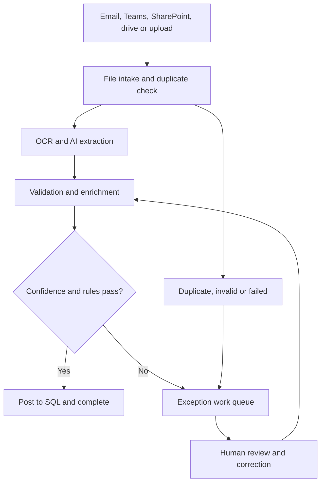
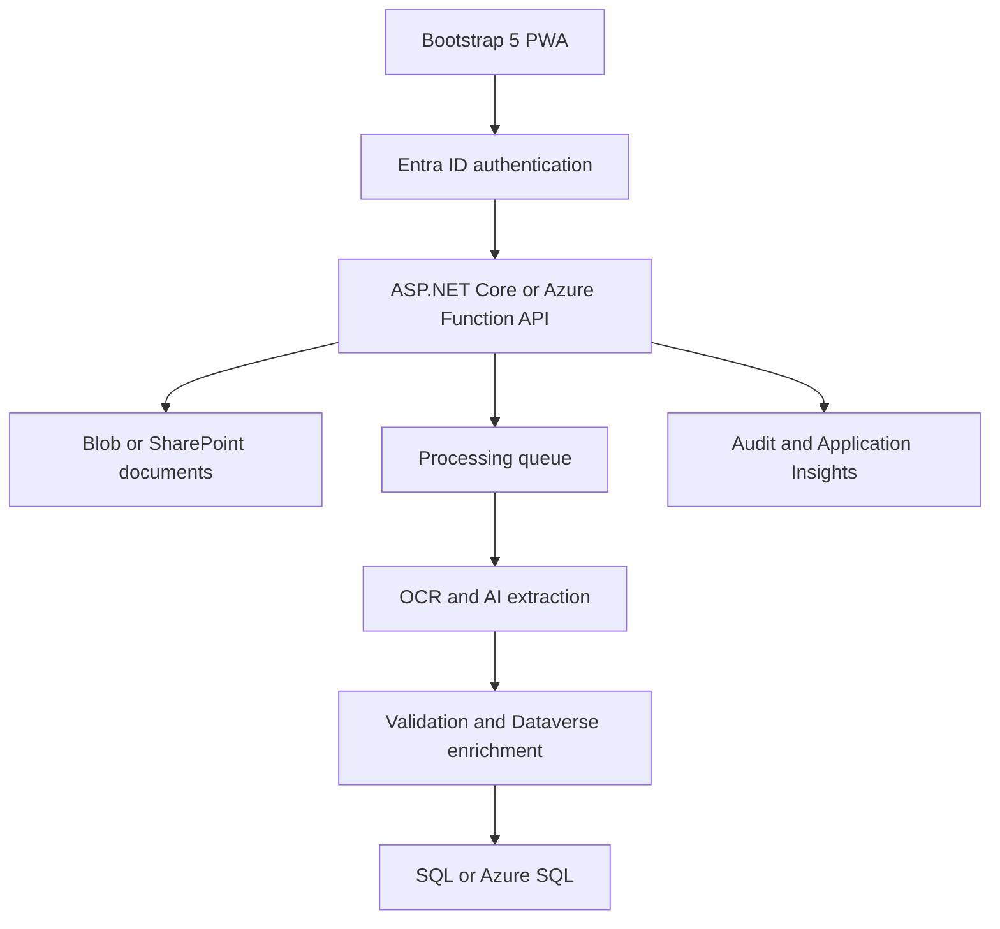

# Concentrix invoice-processing case study

The Concentrix invoice-processing case study modernizes invoice processing with Power Platform and AI - Power Platform _ Microsoft Learn.PDF) describes a high-volume, exception-driven workflow processing:

* More than 100,000 invoices monthly.
* Approximately 6,000–8,000 invoices daily.
* More than 100 utility providers.
* More than 300 invoice layouts.
* Multiple languages.
* Approximately 96% average extraction accuracy.
* Up to 99% accuracy in January 2026.

The important design principle is that users should not manually complete every invoice form. Automation processes invoices straight through, while HTML forms are used primarily for intake exceptions, validation, correction, configuration, and approval.

The document explicitly identifies header, meter, and charge extraction tables. The detailed field definitions below are implementation recommendations because the case study does not publish Concentrix’s complete invoice schema.

# 1. Workflow pattern



The HTML application should follow the invoice’s current status. It should not allow users to select arbitrary workflow states.

# 2. Recommended workflow statuses

| Status                | Meaning                                        | Next valid action         |
| --------------------- | ---------------------------------------------- | ------------------------- |
| `RECEIVED`            | Invoice has entered the platform               | Validate file             |
| `INVALID_FILE`        | File type, size, encryption, or content failed | Replace or reject         |
| `DUPLICATE_SUSPECTED` | Possible matching invoice found                | Resolve duplicate         |
| `QUEUED`              | Waiting for extraction                         | Begin processing          |
| `OCR_PROCESSING`      | OCR preprocessing is running                   | Wait                      |
| `AI_EXTRACTING`       | AI extraction is running                       | Wait                      |
| `DATA_VALIDATION`     | Business rules are being evaluated             | Enrich or route           |
| `DATA_ENRICHMENT`     | Reference mappings are being applied           | Auto-approve or exception |
| `EXCEPTION`           | Human review is required                       | Claim invoice             |
| `IN_REVIEW`           | Assigned to an operations reviewer             | Correct or escalate       |
| `CORRECTED`           | Reviewer saved corrections                     | Revalidate                |
| `REPROCESSING`        | Extraction or validation is rerunning          | Wait                      |
| `APPROVED`            | Data passed validation                         | Post                      |
| `POSTING`             | Data is loading into the target system         | Complete or fail          |
| `COMPLETED`           | Successfully posted                            | Archive                   |
| `POSTING_FAILED`      | Target-system load failed                      | Retry or escalate         |
| `REJECTED`            | Document is not a valid invoice                | Archive                   |
| `ARCHIVED`            | Retention-only state                           | Read only                 |

# 3. Application roles

| Role                         | Responsibilities                                            |
| ---------------------------- | ----------------------------------------------------------- |
| Intake User                  | Manually upload invoices and monitor submissions            |
| Operations Reviewer          | Review, correct, and resubmit exceptions                    |
| Senior Reviewer              | Approve high-value or complex corrections                   |
| Vendor Analyst               | Configure vendors and invoice-layout patterns               |
| AI/Prompt Analyst            | Create, test, and publish extraction prompts                |
| Reference Data Administrator | Maintain vendor, city, ZIP, account, and field mappings     |
| Finance Approver             | Approve invoices requiring financial review                 |
| Platform Administrator       | Manage sources, workflows, security, and environments       |
| Auditor                      | Review documents, corrections, decisions, and audit history |
| Support Engineer             | Diagnose pipeline and posting failures                      |

# 4. Complete HTML form inventory

## Intake forms

| # | HTML form                      | Workflow purpose                                          |
| - | ------------------------------ | --------------------------------------------------------- |
| 1 | `invoice-upload.html`          | Submit one or more invoices manually                      |
| 2 | `intake-source.html`           | Configure email, Teams, SharePoint, drive, or Blob intake |
| 3 | `batch-intake.html`            | Submit and track a batch of invoices                      |
| 4 | `invalid-file-resolution.html` | Replace, reject, or repair invalid files                  |

## Operations forms

| #  | HTML form                    | Workflow purpose                                   |
| -- | ---------------------------- | -------------------------------------------------- |
| 5  | `exception-queue.html`       | Search, filter, assign, and prioritize exceptions  |
| 6  | `invoice-review.html`        | Display the PDF and extracted values together      |
| 7  | `invoice-header.html`        | Validate invoice-level information                 |
| 8  | `service-account.html`       | Validate customer and utility account information  |
| 9  | `meter-readings.html`        | Validate meter and consumption records             |
| 10 | `invoice-charges.html`       | Validate charge line items                         |
| 11 | `invoice-totals.html`        | Reconcile subtotal, taxes, credits, and amount due |
| 12 | `reference-mapping.html`     | Resolve vendor, city, ZIP, and customer mappings   |
| 13 | `duplicate-resolution.html`  | Confirm or reject suspected duplicates             |
| 14 | `exception-disposition.html` | Correct, escalate, reject, or reprocess an invoice |
| 15 | `invoice-approval.html`      | Approve an invoice for posting                     |
| 16 | `posting-recovery.html`      | Retry or redirect failed target-system posts       |

## AI and configuration forms

| #  | HTML form                   | Workflow purpose                                         |
| -- | --------------------------- | -------------------------------------------------------- |
| 17 | `vendor-onboarding.html`    | Register a new utility provider                          |
| 18 | `invoice-pattern.html`      | Register a vendor layout or pattern                      |
| 19 | `extraction-prompt.html`    | Configure general or pattern-specific extraction prompts |
| 20 | `prompt-test.html`          | Test prompt versions against representative invoices     |
| 21 | `reference-data.html`       | Maintain enrichment and normalization values             |
| 22 | `validation-rules.html`     | Configure deterministic invoice rules                    |
| 23 | `pipeline-monitor.html`     | Monitor scheduled batches and processing failures        |
| 24 | `reprocessing-request.html` | Submit controlled bulk reprocessing                      |
| 25 | `audit-search.html`         | Search invoice history and correction activity           |

# 5. Intake-form specifications

## Form 1: Manual invoice upload

Fields:

* Client
* Business unit
* Country
* State or region
* Vendor, if known
* Customer or account, if known
* Source type
* Received date
* Priority
* Processing due date
* Invoice language
* Invoice PDF files
* Submission notes
* Correlation or batch ID
* Requester, populated from authentication

Validation:

* Allow approved PDF or image formats.
* Verify actual MIME type, not only the extension.
* Detect encrypted or password-protected PDFs.
* Validate maximum size and page count.
* Calculate a file hash for duplicate detection.
* Virus-scan before processing.
* Do not require vendor information if the AI is expected to identify it.
* Assign an immutable intake ID before processing.

Actions:

* Upload and process
* Save draft
* Add another invoice
* View submission status

## Form 2: Intake-source configuration

The document identifies email, shared drives, SharePoint, Teams, and an on-premises gateway. Azure Blob Storage is the stated future direction.

Fields:

* Source name
* Source type
* Client
* Business unit
* Email mailbox, SharePoint library, folder, Teams channel, drive path, or Blob container
* File-selection pattern
* Allowed extensions
* Polling schedule
* Batch size
* Gateway connection reference
* Archive location
* Failure location
* Default language
* Default vendor, if applicable
* Data-retention policy
* Source owner
* Enabled status

Security:

* Store only connection references in the application.
* Never expose passwords, tokens, connection strings, or flow URLs in HTML.
* Validate source access through the backend.

## Form 3: Batch intake

Fields:

* Batch ID
* Source
* Client
* Expected invoice count
* Expected total value, if provided
* Submission date
* Processing priority
* SLA deadline
* File manifest
* Notes

Display:

* Total files
* Accepted files
* Rejected files
* Duplicate files
* Processing files
* Exception files
* Completed files

## Form 4: Invalid-file resolution

Display:

* Original filename
* Error category
* Error details
* File hash
* Page count
* File size
* Source
* Received timestamp

Actions:

* Upload replacement
* Retry validation
* Mark as non-invoice
* Reject
* Escalate to support

Require a reason and comment for rejection.

# 6. Exception-review workflow

The review page is the most important HTML form in the solution.

## Form 5: Exception queue

Filters:

* Invoice ID
* Client
* Vendor
* Account number
* State or region
* Invoice date range
* Due-date range
* Amount range
* Source
* Language
* Exception category
* Status
* Confidence range
* Assigned reviewer
* Processing age
* SLA status
* Prompt or model version
* Batch ID

Queue columns:

* Invoice ID
* Vendor
* Invoice number
* Account
* Invoice date
* Due date
* Amount due
* Confidence
* Exception reason
* Age
* Priority
* Assignee
* Status

Actions:

* Claim
* Assign
* Open review
* Bulk assign
* Change priority
* Export permitted results

Use optimistic locking so two reviewers cannot modify the same invoice simultaneously.

## Form 6: Invoice review shell

Desktop layout:

* Left: PDF viewer.
* Right: extracted data form.
* Bottom or side: exception list and audit notes.

Tablet/mobile layout:

* Toggle between document and extracted values.
* Provide a persistent “View Source” button.
* Preserve the reviewer’s current field when switching panels.

Features:

* Page navigation
* Zoom and rotate
* Search document text
* Highlight source area for selected field
* Confidence indicator beside every extracted value
* Original extracted value
* Corrected value
* Validation message
* Reviewer comment
* Previous and next exception
* Save draft
* Revalidate
* Approve
* Escalate
* Reject
* Reprocess

Confidence colors should not be the only indication. Include text such as `High`, `Medium`, or `Low`.

# 7. Extracted invoice forms

## Form 7: Invoice header

The prompt architecture in the document explicitly includes a header table.

Recommended fields:

* Invoice ID
* Invoice number
* Vendor name
* Vendor ID
* Customer name
* Customer ID
* Utility account number
* Invoice date
* Statement date
* Billing-period start
* Billing-period end
* Due date
* Currency
* Purchase-order number
* Cost center
* Service type
* Invoice language
* Payment status
* Source filename
* Source page
* Overall extraction confidence

Validation:

* Invoice number is required.
* Invoice date cannot be unreasonably future-dated.
* Billing-period end must follow the start.
* Due date should not precede the invoice date unless specifically allowed.
* Vendor, account, invoice number, and amount should be used for duplicate checking.

## Form 8: Service account and address

Fields:

* Customer account number
* Utility account number
* Service-address line 1
* Service-address line 2
* City
* State or province
* ZIP or postal code
* Country
* Billing address
* Premise ID
* Location ID
* Contract ID
* Customer reference
* Service category

Enrichment fields:

* Standardized city
* Standardized state
* Standardized ZIP
* Mapped customer
* Mapping source
* Mapping confidence
* Override reason

## Form 9: Meter readings

The document explicitly identifies a meter table.

Use a repeatable row form.

Fields:

* Meter number
* Meter type
* Service type
* Unit of measure
* Read type
* Previous-read date
* Current-read date
* Previous reading
* Current reading
* Multiplier
* Extracted usage
* Calculated usage
* Demand
* Estimated-reading indicator
* Source page
* Row confidence
* Reviewer comment

Validation:

* Current-read date must follow the previous-read date.
* Calculated usage should reconcile with readings and multiplier.
* Negative consumption requires a reason or credit classification.
* Unit of measure must match the service type.
* Duplicate meter rows should be flagged.

## Form 10: Invoice charges

The document explicitly identifies a charge table.

Use an editable Bootstrap table with row add, copy, delete, and reorder actions.

Fields per row:

* Charge category
* Description
* Service period
* Quantity
* Unit of measure
* Rate
* Amount
* Taxable indicator
* Tax amount
* Fee amount
* Credit indicator
* Cost center
* General-ledger code
* Source page
* Confidence
* Validation message

Charge categories:

* Consumption
* Delivery
* Supply
* Demand
* Distribution
* Transmission
* Service fee
* Fuel adjustment
* Environmental fee
* Tax
* Credit
* Late fee
* Other

## Form 11: Totals and reconciliation

Fields:

* Previous balance
* Payments received
* Adjustments
* Current charges
* Subtotal
* Taxes
* Fees
* Credits
* Late charges
* Total amount due
* Minimum amount due
* Calculated total
* Variance
* Currency
* Reconciliation status

Deterministic validation:

```text
Calculated total =
    previous balance
  - payments received
  + adjustments
  + current charges
  + taxes
  + fees
  - credits
  + late charges
```

Route the invoice to exception review when the variance exceeds the configured tolerance.

# 8. Exception and decision forms

## Form 12: Reference-data mapping

Fields:

* Mapping type
* Extracted value
* Suggested standardized value
* Selected standardized value
* Client
* Vendor
* State
* Effective date
* Expiration date
* Apply to current invoice only
* Save as reusable mapping
* Reviewer explanation

Mapping types:

* Vendor
* Customer
* City
* State
* ZIP code
* Service type
* Charge category
* Currency
* Unit of measure
* Cost center
* General-ledger code

Reusable mappings should require elevated permission.

## Form 13: Duplicate resolution

Display side-by-side:

* Current invoice
* Suspected matching invoice
* Vendor
* Account
* Invoice number
* Invoice date
* Amount
* Source
* File hash
* Processing status

Decision fields:

* Confirm duplicate
* Not a duplicate
* Related document
* Credit or corrected invoice
* Replace earlier invoice
* Decision reason
* Reviewer comment

## Form 14: Exception disposition

Fields:

* Exception category
* Root cause
* Corrected fields
* Correction summary
* Reviewer confidence
* Reprocess required
* New vendor pattern identified
* Prompt update suggested
* Escalation team
* Priority
* Reviewer notes

Actions:

* Save correction
* Revalidate
* Send for approval
* Send to vendor analyst
* Send to prompt analyst
* Reject document
* Reprocess with another extraction strategy

## Form 15: Invoice approval

Fields:

* Invoice ID
* Validation summary
* Correction summary
* Total amount
* Variance
* Remaining warnings
* Approver
* Decision
* Decision reason
* Approval comments
* Approval timestamp

Decision values:

* Approve and post
* Approve with warning
* Return for correction
* Reject
* Escalate

High-value or high-risk invoices can require two-stage approval.

## Form 16: Posting recovery

Fields:

* Invoice
* Target system
* Posting request ID
* Error code
* Error message
* Failed timestamp
* Retry count
* Last retry
* Corrected destination values
* Recovery action
* Support ticket
* Notes

Actions:

* Retry
* Resubmit corrected payload
* Route to alternate queue
* Escalate
* Mark manually posted

# 9. Vendor and AI configuration forms

## Form 17: Vendor onboarding

Fields:

* Vendor name
* Vendor ID
* Parent company
* Country
* States served
* Supported languages
* Utility type
* Known account formats
* Known invoice layouts
* Typical billing frequency
* Required extraction fields
* Default currency
* Sample invoices
* Data owner
* Compliance classification
* Active date
* Status

Do not promote a vendor to production until sample invoices pass testing.

## Form 18: Invoice-pattern intake

Fields:

* Pattern name
* Vendor
* Client
* Language
* Layout description
* Identifying text
* Identifying coordinates
* Page-count range
* OCR required
* Extraction strategy
* General or specialized prompt
* AI Builder model, when still required
* Sample documents
* Required fields
* Minimum accuracy
* Effective date
* Status

Extraction strategies:

* Raw PDF text plus general prompt
* OCR plus general prompt
* Raw PDF text plus specialized prompt
* OCR plus specialized prompt
* AI Builder custom model
* Manual review

## Form 19: Extraction-prompt configuration

The case study specifies the prompt structure.

Sections:

1. General instructions
2. Global extraction rules
3. Missing-value rules
4. Formatting rules
5. Header-table rules
6. Meter-table rules
7. Charge-table rules
8. Vendor variations
9. Customer variations
10. Expected JSON schema
11. Example input
12. Example output

Configuration fields:

* Prompt name
* Version
* Prompt type
* Supported vendors
* Supported languages
* Model deployment
* Temperature or variability control
* Maximum output size
* JSON schema version
* Effective date
* Owner
* Approval status

Important instruction:

* Missing fields must return `null`.
* The model must not calculate, infer, or invent values unless the specific field rule authorizes it.
* All amounts must preserve the source currency.
* Output must conform to a server-validated JSON schema.

## Form 20: Prompt testing and promotion

Fields:

* Prompt version
* Model
* Test dataset
* Vendor
* Layout
* Language
* Expected record count
* Required accuracy
* Header accuracy
* Meter accuracy
* Charge accuracy
* Total reconciliation accuracy
* JSON validity
* Average processing time
* Average cost
* Regression count
* Tester notes

Actions:

* Run test
* Compare with production prompt
* Download discrepancies
* Approve for test
* Approve for production
* Reject
* Roll back

Never promote a prompt based on overall accuracy alone. Critical fields such as invoice number, account, due date, and total amount require separate thresholds.

# 10. Operational configuration forms

## Form 21: Reference-data maintenance

Maintain:

* Vendors
* Customers
* Cities
* States
* ZIP codes
* Languages
* Currencies
* Units of measure
* Utility types
* Charge categories
* General-ledger codes
* Cost centers

Fields:

* Reference type
* Source value
* Standard value
* Client
* Vendor
* Effective dates
* Priority
* Active status
* Change reason

## Form 22: Validation-rule configuration

Fields:

* Rule name
* Rule category
* Applicable client
* Applicable vendor
* Applicable invoice pattern
* Field
* Operator
* Expected value
* Severity
* Failure action
* User-facing message
* Effective dates
* Active status

Severity levels:

* Information
* Warning
* Exception
* Blocking

Failure actions:

* Continue
* Route to review
* Require approval
* Reject
* Stop posting

## Form 23: Pipeline monitor

Filters:

* Date range
* Source
* Client
* Vendor
* Batch
* Pipeline stage
* Status
* Environment

KPI cards should include the measures visible in the case-study application:

* Total invoices
* Processed invoices
* Manual-review invoices
* Errored invoices
* Hours saved

Additional metrics:

* Straight-through processing rate
* Extraction accuracy
* Exception rate
* Duplicate rate
* Average processing time
* Average review time
* SLA breaches
* Posting failures
* Invoices per extraction strategy
* Prompt-version accuracy

## Form 24: Reprocessing request

Fields:

* Reprocessing scope
* Invoice IDs or batch
* Date range
* Vendor
* Client
* Current status
* New extraction strategy
* Prompt version
* Reason
* Estimated invoice count
* Approval
* Maintenance window
* Notification group

Bulk reprocessing should require a preview of the exact invoice count before submission.

# 11. Role-based workflow actions

| Current state  | Reviewer                  | Senior reviewer   | Administrator      |
| -------------- | ------------------------- | ----------------- | ------------------ |
| Received       | View                      | View              | Cancel             |
| Processing     | View only                 | View only         | Stop future batch  |
| Exception      | Claim                     | Assign            | Reassign           |
| In Review      | Correct, save, revalidate | Correct, escalate | Reassign           |
| Corrected      | Submit                    | Approve           | Reprocess          |
| Approved       | View                      | View              | Post               |
| Posting Failed | View                      | Approve retry     | Retry or redirect  |
| Completed      | View                      | View              | Reopen with reason |
| Rejected       | View                      | Restore           | Archive            |

The backend should return allowed actions:

```json
{
  "invoiceId": "INV-2026-00018492",
  "status": "IN_REVIEW",
  "version": 7,
  "allowedActions": [
    "save",
    "revalidate",
    "escalate",
    "reject"
  ]
}
```

The browser should render buttons from `allowedActions`, but the API must independently enforce them.

# 12. Recommended architecture for an HTML implementation



Recommended components:

* Bootstrap 5 responsive HTML.
* Progressive Web App support for mobile operations.
* Microsoft Entra ID authentication.
* ASP.NET Core Web API or Azure Functions.
* Azure Blob Storage or SharePoint for invoice PDFs.
* Service Bus for processing and retry queues.
* Azure AI Document Intelligence or equivalent OCR.
* Prompt-based extraction with strict JSON output.
* Dataverse or Azure SQL reference data.
* Azure SQL for final processed records.
* Application Insights for performance and failures.

# 13. Data model

| Entity              | Purpose                                           |
| ------------------- | ------------------------------------------------- |
| `Invoices`          | Master invoice and workflow status                |
| `InvoiceDocuments`  | PDF metadata and secure storage location          |
| `InvoiceHeaders`    | Header extraction values                          |
| `ServiceAccounts`   | Utility account and address data                  |
| `MeterReadings`     | Meter-level values                                |
| `InvoiceCharges`    | Charge line items                                 |
| `InvoiceTotals`     | Totals and reconciliation                         |
| `FieldExtractions`  | Raw, extracted, confidence, and corrected values  |
| `InvoiceExceptions` | Validation and processing exceptions              |
| `InvoiceDecisions`  | Review and approval decisions                     |
| `Vendors`           | Provider master data                              |
| `InvoicePatterns`   | Vendor-layout definitions                         |
| `ExtractionPrompts` | Versioned AI instructions                         |
| `PromptTestRuns`    | Accuracy and regression results                   |
| `ReferenceMappings` | Standardization and enrichment mappings           |
| `ValidationRules`   | Deterministic business rules                      |
| `IntakeSources`     | Email, Teams, SharePoint, drive, and Blob sources |
| `ProcessingBatches` | Batch execution information                       |
| `PipelineEvents`    | Stage-by-stage processing events                  |
| `AuditEvents`       | Immutable activity history                        |

Every extracted field should preserve:

* Raw source text.
* AI-extracted value.
* Confidence.
* Source page.
* Source coordinates, when available.
* Corrected value.
* Corrected by.
* Correction timestamp.
* Correction reason.

# 14. HTML project structure

```text
invoice-automation/
├── index.html
├── intake/
│   ├── invoice-upload.html
│   ├── batch-intake.html
│   ├── intake-source.html
│   └── invalid-file-resolution.html
├── operations/
│   ├── exception-queue.html
│   ├── invoice-review.html
│   ├── invoice-header.html
│   ├── service-account.html
│   ├── meter-readings.html
│   ├── invoice-charges.html
│   ├── invoice-totals.html
│   ├── reference-mapping.html
│   ├── duplicate-resolution.html
│   ├── exception-disposition.html
│   ├── invoice-approval.html
│   └── posting-recovery.html
├── administration/
│   ├── vendor-onboarding.html
│   ├── invoice-pattern.html
│   ├── extraction-prompt.html
│   ├── prompt-test.html
│   ├── reference-data.html
│   ├── validation-rules.html
│   ├── pipeline-monitor.html
│   └── reprocessing-request.html
├── assets/
│   ├── css/
│   │   ├── app.css
│   │   ├── forms.css
│   │   ├── review-workspace.css
│   │   └── confidence.css
│   └── js/
│       ├── auth.js
│       ├── api.js
│       ├── workflow.js
│       ├── validation.js
│       ├── pdf-viewer.js
│       ├── invoice-review.js
│       ├── line-items.js
│       ├── reconciliation.js
│       └── audit.js
└── components/
    ├── navigation.html
    ├── workflow-stepper.html
    ├── pdf-panel.html
    ├── confidence-field.html
    ├── exception-panel.html
    ├── audit-timeline.html
    └── confirmation-modal.html
```

# 15. API endpoints

| Method | Endpoint                           | Purpose                      |
| ------ | ---------------------------------- | ---------------------------- |
| `POST` | `/api/invoices`                    | Upload an invoice            |
| `POST` | `/api/batches`                     | Upload a batch               |
| `GET`  | `/api/invoices`                    | Search invoices              |
| `GET`  | `/api/invoices/{id}`               | Retrieve invoice workspace   |
| `GET`  | `/api/invoices/{id}/document`      | Securely retrieve PDF        |
| `PUT`  | `/api/invoices/{id}/header`        | Save corrected header        |
| `PUT`  | `/api/invoices/{id}/accounts`      | Save service accounts        |
| `PUT`  | `/api/invoices/{id}/meters`        | Save meter readings          |
| `PUT`  | `/api/invoices/{id}/charges`       | Save charge rows             |
| `POST` | `/api/invoices/{id}/validate`      | Run deterministic validation |
| `POST` | `/api/invoices/{id}/reprocess`     | Rerun extraction             |
| `POST` | `/api/invoices/{id}/decisions`     | Submit review decision       |
| `POST` | `/api/invoices/{id}/approve`       | Approve for posting          |
| `POST` | `/api/invoices/{id}/post`          | Post validated record        |
| `POST` | `/api/invoices/{id}/retry-posting` | Retry failed posting         |
| `POST` | `/api/vendors`                     | Register a vendor            |
| `POST` | `/api/patterns`                    | Create an invoice pattern    |
| `POST` | `/api/prompts`                     | Create a prompt version      |
| `POST` | `/api/prompts/{id}/tests`          | Run prompt tests             |
| `GET`  | `/api/pipelines/runs`              | Retrieve pipeline status     |

# 16. Build sequence

1. Document the required header, meter, and charge fields for each client.
2. Define invoice workflow statuses and valid transitions.
3. Define roles and separation-of-duty rules.
4. Create the invoice, extraction, exception, decision, and audit schemas.
5. Configure secure document storage.
6. Build Entra ID authentication and API authorization.
7. Build the shared Bootstrap 5 layout and navigation.
8. Build manual and batch-upload forms.
9. Build the exception queue.
10. Build the side-by-side PDF and extracted-data workspace.
11. Build header, account, meter, charge, and total forms.
12. Add field-level confidence and source-location indicators.
13. Implement deterministic validation and reconciliation.
14. Add reference-data enrichment and mapping.
15. Implement duplicate detection and resolution.
16. Add reviewer assignment and optimistic record locking.
17. Build approval and posting-recovery forms.
18. Build vendor and pattern onboarding.
19. Build versioned prompt configuration.
20. Create prompt-testing and regression workflows.
21. Add 15-minute scheduled intake and controlled batching.
22. Implement Service Bus retry and dead-letter handling.
23. Build pipeline monitoring and KPI reporting.
24. Add multilingual document metadata and test datasets.
25. Conduct volume testing with projected daily peaks.
26. Run parallel testing against the current manual process.
27. Deploy through development, test, UAT, and production.
28. Onboard additional invoice volumes in controlled increments.

# 17. Critical controls

* AI extracts; deterministic rules decide whether an invoice can proceed.
* Missing values must return `null`, not inferred data.
* Never overwrite raw extraction results.
* Keep every reviewer correction in the audit history.
* Require reasons for rejection, override, reprocessing, and reopening.
* Reconcile charges against invoice totals.
* Use field-level confidence, not only overall confidence.
* Route critical-field failures to review regardless of average confidence.
* Prevent duplicate processing with file hash and business-key checks.
* Scan uploaded files and restrict document access.
* Do not let the browser call AI models or workflow endpoints using embedded credentials.
* Use background jobs for extraction and posting; do not hold the browser request open.
* Maintain separate development, test, UAT, and production prompt versions.
* Support prompt rollback.
* Track accuracy by vendor, pattern, field, language, and prompt version.

This structure follows the document’s workflow pattern: automate common invoices, isolate exceptions, present the PDF and extracted information together, capture controlled corrections, revalidate deterministically, and maintain complete visibility from intake through final posting.
