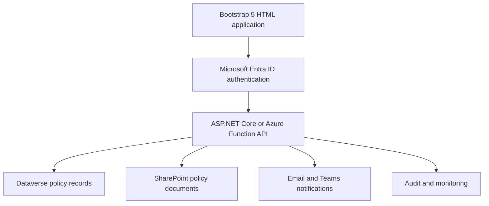
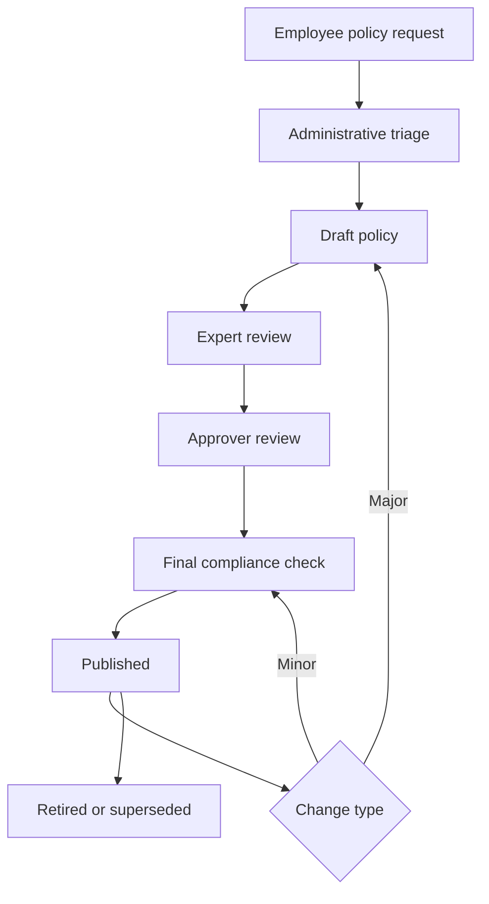

## Document analysis

The [Daimler Truck Policy Navigator case study](sandbox:/workspace/scratch/a1a80a8ea9b8/upload/Daimler Truck transforms policy management with Power Apps, Dataverse, and managed environments - Power Platform _ Microsoft.PDF) describes a company-wide policy-management platform with three primary components:

* Employee-facing application for finding, reading, requesting, and following policies.
* Administrator application for creating policies and managing their lifecycle.
* Document repository for policy files and collaboration.

The document does not provide the original database schema or exact form definitions. The following HTML form design is therefore a detailed implementation blueprint derived from the described features and visible application tabs.

## 1. Recommended solution architecture

Since HTML alone cannot securely store policies, manage approvals, or enforce permissions, use the HTML forms as the presentation layer.



For an Azure-centered implementation:

* Bootstrap 5 for the responsive interface.
* JavaScript modules for form behavior and API calls.
* Microsoft Entra ID for authentication.
* ASP.NET Core Web API or Azure Functions for backend services.
* Dataverse for structured policy information.
* SharePoint for documents and collaboration.
* Power Automate or Logic Apps for notifications and approvals.
* Application Insights for logging and monitoring.

## 2. Application roles

| Role          | Capabilities                                                  |
| ------------- | ------------------------------------------------------------- |
| Employee      | Search, filter, read, request, and follow policies            |
| Policy Editor | Create drafts and edit assigned policies                      |
| Policy Owner  | Manage policy content, scope, experts, and documents          |
| Expert/SME    | Review technical or business content                          |
| Approver      | Approve, reject, or return policies                           |
| Administrator | Manage all policies, assignments, permissions, and publishing |
| Auditor       | Read policy history, decisions, and audit records             |

Permissions must be validated by the backend. Hiding an HTML button is not sufficient security.

## 3. Complete HTML form inventory

### Employee forms

| # | HTML form                  | Purpose                                               |
| - | -------------------------- | ----------------------------------------------------- |
| 1 | `policy-search.html`       | Search and filter published policies                  |
| 2 | `policy-request.html`      | Request that a new corporate policy be created        |
| 3 | `policy-subscription.html` | Subscribe to policy updates using “Keep Me Posted”    |
| 4 | `policy-feedback.html`     | Report an error, ask a question, or suggest an update |

### Administrator and policy-owner forms

| #  | HTML form                 | Purpose                                                 |
| -- | ------------------------- | ------------------------------------------------------- |
| 5  | `policy-details.html`     | Create or edit the main policy record                   |
| 6  | `policy-editors.html`     | Assign policy owners and editors                        |
| 7  | `policy-scope.html`       | Define regions, departments, plants, and business roles |
| 8  | `policy-permissions.html` | Configure policy visibility and access                  |
| 9  | `policy-documents.html`   | Upload and manage policy documents                      |
| 10 | `policy-experts.html`     | Assign subject-matter experts                           |
| 11 | `policy-approvers.html`   | Configure approval sequence                             |
| 12 | `policy-comments.html`    | Capture review and collaboration comments               |
| 13 | `policy-related.html`     | Connect supporting or related policies                  |
| 14 | `policy-revision.html`    | Submit minor or major policy changes                    |
| 15 | `policy-review.html`      | Record expert and approver decisions                    |
| 16 | `policy-publication.html` | Complete final checks and publish                       |
| 17 | `policy-retirement.html`  | Retire, archive, or supersede a policy                  |

## 4. Form specifications

### Form 1: Policy search and filtering

This is the employee home page described in the case study.

Fields:

* Search text
* Policy number
* Policy title
* Department
* Region
* Country
* Plant ID
* Business role
* Policy category
* Effective-date range
* Status
* Sort order

Results should display:

* Policy number
* Policy name
* Short description
* Category
* Effective date
* Applicable region
* Current version
* “View Policy” action
* “Keep Me Posted” action

Implementation requirements:

* Allow multiple filters.
* Use server-side pagination.
* Preserve filter selections in the URL.
* Debounce free-text searches.
* Provide a “Clear filters” button.
* Display only policies the authenticated user can access.

### Form 2: New policy request

Fields:

* Request title
* Requested policy name
* Business problem or requirement
* Reason the policy is needed
* Suggested policy category
* Requesting department
* Region
* Country
* Plant ID
* Applicable business roles
* Proposed policy owner
* Regulatory or compliance driver
* Requested completion date
* Priority
* Supporting attachments
* Additional comments
* Requester name and email, populated from Entra ID
* Acknowledgment checkbox

Validations:

* Title: 10–150 characters.
* Business requirement: minimum 50 characters.
* At least one department, region, or global scope selection.
* Requested date cannot be in the past.
* Attachments limited to approved formats.
* Regulatory requests require a compliance explanation.

Submission should create a `PolicyRequest` record with status `Submitted`.

### Form 3: Keep Me Posted subscription

Fields:

* Policy ID, hidden
* Policy title, read-only
* Employee name
* Employee email
* Notification events:

  * Minor update
  * Major update
  * New document
  * Publication
  * Retirement
* Notification channel:

  * Email
  * Teams
* Subscription acknowledgment

Provide both `Subscribe` and `Unsubscribe` actions.

### Form 4: Policy feedback

Fields:

* Policy ID
* Feedback type
* Question, correction, or recommendation
* Page or section reference
* Business impact
* Suggested correction
* Attachment
* Requester information
* Permission to contact requester

Feedback types:

* Incorrect information
* Outdated information
* Missing information
* Clarification request
* Accessibility issue
* General suggestion

### Form 5: Policy details

This is the first section of the administrator wizard.

Fields:

* Policy ID, generated
* Policy number, generated or administrator assigned
* Policy title
* Short title
* Summary
* Full description
* Policy category
* Policy type
* Owning department
* Policy owner
* Business sponsor
* Language
* Current status
* Current version
* Confidentiality classification
* Effective date
* Review date
* Expiration date
* Regulatory reference
* Tags and keywords

Validations:

* Policy title must be unique within the applicable organization.
* Review date must be after the effective date.
* Expiration date must be after the effective date.
* Owner and owning department are required.
* Published policies require a summary and document.

### Form 6: Editors and owners

Fields:

* Policy owner
* Deputy owner
* Primary editor
* Additional editors
* Editor department
* Access start date
* Access expiration date
* Permission level
* Assignment reason

Permission levels:

* Read
* Edit metadata
* Edit documents
* Manage reviewers
* Submit for approval
* Publish

### Form 7: Scope of application

The case study specifically identifies filtering by department, region, plant ID, and business role.

Fields:

* Scope type:

  * Global
  * Regional
  * Country
  * Department
  * Plant
  * Business role
* Regions
* Countries
* Departments
* Plant IDs
* Legal entities
* Business units
* Business roles
* Employee types
* Included groups
* Excluded groups
* Scope explanation

Rules:

* Selecting `Global` disables narrower required fields.
* Otherwise, at least one scope assignment is required.
* Exclusions cannot duplicate inclusions.
* Scope changes to published policies should trigger impact review.

### Form 8: Policy permissions

Fields:

* Visibility:

  * All employees
  * Selected groups
  * Restricted
* Entra security groups
* Departments
* Regions
* Business roles
* Editors
* Viewers
* Download permission
* Print permission
* Restricted-document indicator
* Access expiration date
* Permission justification

### Form 9: Documents

Fields:

* Policy ID
* Document title
* Document type
* File upload
* Document language
* Document category
* Version label
* Effective date
* Owner
* SharePoint folder
* Description
* Primary-document checkbox
* Download permission
* Confidentiality level

Recommended document types:

* Primary policy
* Procedure
* Standard
* Guideline
* Template
* Work instruction
* Regulatory reference
* Supporting document

Controls:

* Allow PDF, DOCX, XLSX, and PPTX as approved.
* Validate extension, MIME type, and size.
* Scan uploads for malware.
* Store files in SharePoint, not directly in the HTML application.
* Keep document version history.
* Prevent published files from being silently overwritten.

### Form 10: Experts

Fields:

* Expert name
* Expert type
* Department
* Region
* Area of expertise
* Review sequence
* Required or optional
* Review due date
* Escalation contact
* Instructions
* Status

### Form 11: Approvers

Fields:

* Approver name
* Approver role
* Approval level
* Approval sequence
* Required or optional
* Due date
* Delegated approver
* Escalation contact
* Approval instructions

Rules:

* An approver should not approve their own submitted change unless explicitly allowed.
* Required approval levels cannot be skipped.
* Duplicate approvers should be prevented.
* Approval decisions must be timestamped.

### Form 12: Comments

Fields:

* Policy ID
* Policy section
* Comment type
* Comment
* Mentioned users
* Attachment
* Visibility
* Resolution status
* Resolution response

Comment types:

* General
* Legal
* Compliance
* Technical
* Editorial
* Approval condition

### Form 13: Related policies

Fields:

* Related policy
* Relationship type
* Description
* Display order
* Effective date
* Required reading
* Dependency indicator

Relationship types:

* Replaces
* Replaced by
* Supports
* Depends on
* Related to
* Conflicts with
* Implements

### Form 14: Policy revision

Fields:

* Current policy and version
* Change type
* Change summary
* Reason for change
* Sections affected
* Regulatory impact
* Scope impact
* Permission impact
* Document changes
* Stakeholders affected
* Requested effective date
* Supporting evidence

Revision rules:

* Minor change: spelling, formatting, link, or nonmaterial clarification.
* Major change: scope, obligations, ownership, permissions, or regulatory meaning.
* Minor changes may retain the public version number.
* Every change must still create an internal audit revision.
* Major changes restart the review and approval workflow.

### Form 15: Review and approval

Fields:

* Policy
* Version
* Reviewer or approver
* Decision
* Decision comments
* Conditions
* Required corrections
* Reviewed sections
* Decision date
* Electronic acknowledgment

Decision values:

* Approve
* Approve with conditions
* Return for changes
* Reject

### Form 16: Publication

Fields:

* Final title
* Final version
* Effective date
* Next review date
* Publication audience
* Notification audience
* Primary document confirmation
* Scope confirmation
* Permission confirmation
* Approval completion confirmation
* Accessibility check
* Legal/compliance check
* Publication notes
* Publish confirmation

The server must verify all required approvals before publication.

### Form 17: Retirement and archive

Fields:

* Policy
* Retirement type
* Retirement reason
* Retirement date
* Replacement policy
* Archive location
* Subscriber notification
* Redirect old policy links
* Retention period
* Final administrator confirmation

## 5. Policy lifecycle



Recommended statuses:

1. Requested
2. Under Triage
3. Draft
4. Expert Review
5. Returned for Changes
6. Approval Pending
7. Final Check
8. Ready to Publish
9. Published
10. Retired
11. Rejected
12. Archived

## 6. Recommended data model

| Entity/table          | Stores                                            |
| --------------------- | ------------------------------------------------- |
| `Users`               | Employee profile and Entra object ID              |
| `PolicyRequests`      | New-policy requests                               |
| `Policies`            | Master policy record                              |
| `PolicyVersions`      | Version and revision history                      |
| `PolicyScopes`        | Region, department, plant, and role applicability |
| `PolicyPermissions`   | Visibility and access assignments                 |
| `PolicyDocuments`     | SharePoint document metadata                      |
| `PolicyEditors`       | Owners and editors                                |
| `PolicyExperts`       | Subject-matter experts                            |
| `PolicyApprovals`     | Approvers, sequence, and decisions                |
| `PolicyComments`      | Review comments                                   |
| `RelatedPolicies`     | Policy relationships                              |
| `PolicySubscriptions` | Keep Me Posted registrations                      |
| `PolicyFeedback`      | Questions and correction requests                 |
| `AuditEvents`         | Immutable activity history                        |

## 7. HTML project structure

```text
policy-navigator/
├── index.html
├── employee/
│   ├── policy-search.html
│   ├── policy-details.html
│   ├── policy-request.html
│   ├── policy-subscription.html
│   └── policy-feedback.html
├── admin/
│   ├── policy-list.html
│   ├── policy-details.html
│   ├── policy-editors.html
│   ├── policy-scope.html
│   ├── policy-permissions.html
│   ├── policy-documents.html
│   ├── policy-experts.html
│   ├── policy-approvers.html
│   ├── policy-comments.html
│   ├── policy-related.html
│   ├── policy-revision.html
│   ├── policy-review.html
│   ├── policy-publication.html
│   └── policy-retirement.html
├── assets/
│   ├── css/
│   │   ├── app.css
│   │   └── forms.css
│   ├── js/
│   │   ├── auth.js
│   │   ├── api.js
│   │   ├── validation.js
│   │   ├── lookups.js
│   │   ├── form-state.js
│   │   └── notifications.js
│   └── images/
└── components/
    ├── header.html
    ├── navigation.html
    ├── policy-stepper.html
    ├── confirmation-modal.html
    └── footer.html
```

## 8. Form development pattern

Every form should follow the same structure:

1. Use a semantic `<form>` element.
2. Divide longer forms into `<fieldset>` sections.
3. Associate every input with a `<label>`.
4. Mark required fields in the label and with `required`.
5. Use Bootstrap’s grid for responsive layouts.
6. Show validation messages immediately below the affected field.
7. Provide:

   * Save Draft
   * Save and Continue
   * Submit
   * Cancel
8. Add a confirmation modal before final submission.
9. Disable duplicate submissions while the request is processing.
10. Display a success message with the generated request or policy number.
11. Preserve drafts in the backend.
12. Warn users before leaving a form with unsaved changes.

For the administrative process, use a stepper:

```text
Details → Editors → Scope → Permissions → Documents
        → Experts → Approvers → Related → Review → Publish
```

## 9. API endpoints

| Method   | Endpoint                           | Function                   |
| -------- | ---------------------------------- | -------------------------- |
| `GET`    | `/api/policies`                    | Search accessible policies |
| `GET`    | `/api/policies/{id}`               | Retrieve policy details    |
| `POST`   | `/api/policy-requests`             | Create a policy request    |
| `POST`   | `/api/policies`                    | Create a draft policy      |
| `PUT`    | `/api/policies/{id}`               | Update policy information  |
| `PUT`    | `/api/policies/{id}/scope`         | Save applicability         |
| `PUT`    | `/api/policies/{id}/permissions`   | Save access rules          |
| `POST`   | `/api/policies/{id}/documents`     | Register uploaded document |
| `POST`   | `/api/policies/{id}/experts`       | Assign experts             |
| `POST`   | `/api/policies/{id}/approvers`     | Assign approvers           |
| `POST`   | `/api/policies/{id}/reviews`       | Record a review decision   |
| `POST`   | `/api/policies/{id}/revisions`     | Request a revision         |
| `POST`   | `/api/policies/{id}/publish`       | Publish an approved policy |
| `POST`   | `/api/policies/{id}/subscriptions` | Subscribe to updates       |
| `DELETE` | `/api/policies/{id}/subscriptions` | Unsubscribe                |
| `POST`   | `/api/policies/{id}/retire`        | Retire or supersede policy |

## 10. Implementation sequence

1. Define roles, lifecycle statuses, policy categories, and lookup values.
2. Build the Dataverse tables and relationships.
3. Configure the SharePoint document library and folder structure.
4. Register the application with Microsoft Entra ID.
5. Build the Bootstrap 5 application shell and responsive navigation.
6. Build employee search, policy details, requests, subscriptions, and feedback.
7. Build the administrator policy wizard.
8. Add reusable department, region, plant, user, and role selectors.
9. Implement client-side and server-side validation.
10. Connect HTML forms to the API.
11. Add SharePoint document-upload integration.
12. Implement expert review and sequential approval workflows.
13. Add minor and major revision handling.
14. Implement email or Teams notifications.
15. Add audit logging for every create, update, approval, publication, and retirement event.
16. Test accessibility using keyboard navigation and screen readers.
17. Test authorization by attempting restricted operations with each role.
18. Conduct mobile, tablet, and desktop testing.
19. Deploy into separate development, test, UAT, and production environments.
20. Monitor errors, approval delays, search performance, and user adoption.

This design converts the case study into a complete, buildable HTML policy-management solution while preserving its core employee experience, administrative governance, document collaboration, lifecycle control, and notification capabilities.
