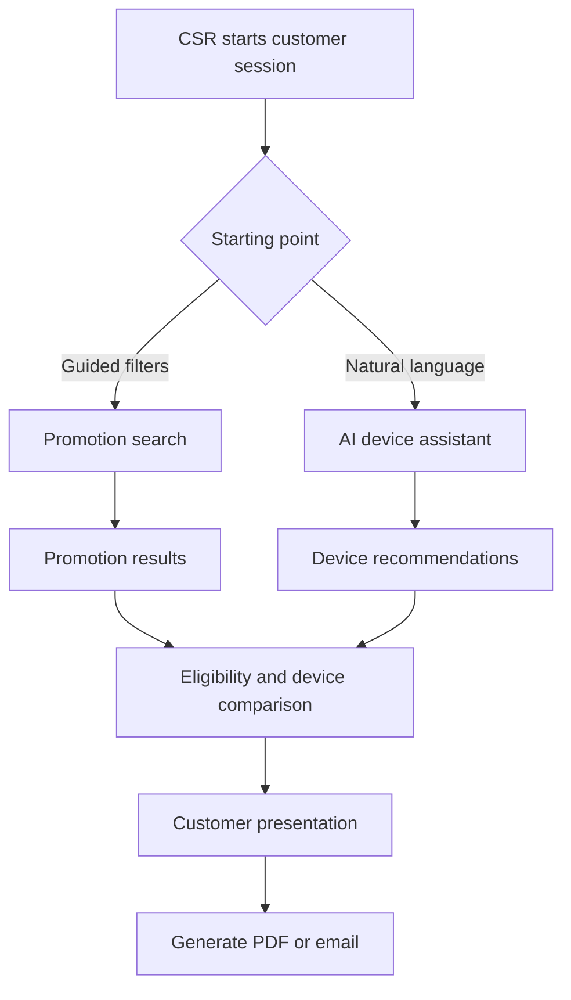

# T-Mobile PromoGenius case study

The T-Mobile PromoGenius case study empowers customer service representatives using Power Apps and Copilot Studio - Power Platform _ Microsoft Learn.PDF) describes a guided sales-assistance application for retail and call-center customer service representatives.

The solution combines:

* Dropdown-driven promotional filtering.
* Device and trade-in comparison.
* Natural-language questions through an embedded AI agent.
* Promotion data stored in Dataverse.
* Device specifications retrieved from manufacturer websites.
* Bing Custom Search for prioritized and blocked sources.
* Nightly Microsoft Fabric data ingestion from SAP, Oracle, and Excel.
* Customer-friendly comparison results.
* Planned PDF creation and customer email delivery.

The source does not provide its underlying schema or original form definitions. The following is a complete HTML implementation blueprint based on the document’s screenshots, workflow, and operational requirements.

# 1. Core user experience

The primary HTML workflow should be optimized for an iPad and completed with minimal typing.



The application should support both starting paths:

1. Filter promotions and then ask detailed product questions.
2. Ask the agent for recommendations and then filter matching promotions.

# 2. HTML form inventory

## CSR-facing forms

| # | HTML form                    | Purpose                                          |
| - | ---------------------------- | ------------------------------------------------ |
| 1 | `promotion-search.html`      | Find promotions through guided filters           |
| 2 | `customer-needs.html`        | Capture the customer’s device requirements       |
| 3 | `device-comparison.html`     | Compare two or more devices                      |
| 4 | `ai-assistant.html`          | Ask natural-language device questions            |
| 5 | `promotion-details.html`     | Review promotion terms and eligibility           |
| 6 | `eligibility-check.html`     | Validate customer and device eligibility         |
| 7 | `customer-presentation.html` | Create a customer-friendly recommendation        |
| 8 | `customer-delivery.html`     | Generate and email a PDF report                  |
| 9 | `csr-feedback.html`          | Submit feedback about promotions or AI responses |

## Administrative forms

| #  | HTML form                    | Purpose                                         |
| -- | ---------------------------- | ----------------------------------------------- |
| 10 | `promotion-intake.html`      | Add or update promotional offers                |
| 11 | `promotion-eligibility.html` | Define promotion qualification rules            |
| 12 | `device-intake.html`         | Maintain device specifications                  |
| 13 | `trade-in-value.html`        | Maintain trade-in device values                 |
| 14 | `rate-plan.html`             | Maintain eligible rate plans                    |
| 15 | `knowledge-source.html`      | Register websites and documents                 |
| 16 | `blocked-source.html`        | Exclude unreliable or prohibited pages          |
| 17 | `agent-configuration.html`   | Configure AI instructions and behavior          |
| 18 | `agent-topic.html`           | Configure topics or specialized agents          |
| 19 | `data-source.html`           | Register SAP, Oracle, Excel, and other sources  |
| 20 | `pipeline-monitor.html`      | Review ingestion status and data freshness      |
| 21 | `content-compliance.html`    | Retain expired promotions for compliance        |
| 22 | `environment-settings.html`  | Manage development, test, and production values |

# 3. CSR form specifications

## Form 1: Promotion search

The screenshots show four primary filter sections.

### Engagement

* Device type
* SOC code
* Transaction type
* Activation type
* Existing customer or new customer
* Sales channel
* Store or call-center location

Example device-type values:

* Voice activation
* Upgrade
* New line
* Add a line
* Mobile internet
* Wearable
* Home internet

### Customer profile

* Include port-in-required offers?

  * Yes
  * No
  * Only
* New or existing customer
* Customer segment
* Number of lines
* Current rate plan
* Desired rate plan
* Military eligibility
* First responder eligibility
* Senior eligibility
* Business-account indicator

Do not collect sensitive supporting documentation in this search form.

### Purchase device

* Manufacturer/OEM
* Device model
* Device family
* Storage capacity
* Color
* Purchase method
* Financing term
* Available inventory only

### Trade-in device

* Manufacturer/OEM
* Device model
* Storage capacity
* Device condition
* Fully paid indicator
* Estimated trade-in value
* Device identifier only when operationally necessary

### Actions

* Apply filters
* Hide filters
* Reset all
* Save search
* Compare selected devices
* Leave feedback

### Results

The document shows these result columns:

* Promotion
* Eligible devices
* Promotional value
* Required rate plan
* Required trade-in device
* Port-in required
* View details

Additional recommended columns:

* Start date
* Expiration date
* Customer segment
* Channel availability
* Compatibility warning
* Last data refresh

### Behavior

* Use cascading dropdowns.
* Selecting an OEM reloads the model dropdown.
* Results should refresh without reloading the page.
* Show active promotions by default.
* Expired offers should be excluded from CSR results.
* Display “Limited-time offers, subject to change.”
* Show the last successful promotion-data refresh.

## Form 2: Customer needs and recommendation

This is the structured alternative to an open-ended AI question.

Fields:

* Primary use:

  * Business
  * Photography
  * Gaming
  * Streaming
  * Social media
  * Basic communication
  * Accessibility
* Preferred manufacturer
* Current device
* Monthly device budget
* Desired screen size
* Storage requirement
* Battery priority
* Camera priority
* Performance priority
* Durability requirement
* Operating-system preference
* Connectivity requirement
* Accessibility requirement
* Trade-in available
* Port-in required
* Additional customer needs

The form should convert selections into a structured recommendation request.

Example:

> Recommend two phones under $35 per month with strong battery life, at least 256 GB of storage, and an eligible trade-in promotion.

## Form 3: Device comparison

Fields:

* Device 1 manufacturer
* Device 1 model
* Device 2 manufacturer
* Device 2 model
* Optional third device
* Comparison categories
* Applicable promotion
* Include trade-in value
* Include rate-plan requirements
* Customer-priority ranking

Comparison categories:

* Display
* Processor
* Memory
* Storage
* Camera
* Battery
* Charging
* Connectivity
* Durability
* Dimensions
* Weight
* Operating system
* Accessibility
* Price
* Promotional price

Display results in a side-by-side responsive table, as required by the case study’s agent instructions.

On smaller screens, convert each comparison category into stacked cards instead of forcing horizontal scrolling.

## Form 4: AI device assistant

The screenshot provides three starter actions:

* Compare devices
* Get device details
* Other

Components:

* Conversation history
* Suggested prompts
* Question input
* Microphone button
* Send button
* Clear conversation
* Copy response
* Add response to presentation
* Report inaccurate response
* Source links

Recommended input controls:

* Maximum 500 characters, consistent with the screenshot.
* Prevent empty submissions.
* Add example prompts below the input.
* Support follow-up questions using conversation context.

AI response requirements:

* Device details must use bullet points.
* Comparisons must use a table.
* Promotions must show effective and expiration dates.
* Every externally sourced factual response should provide source links.
* Display an AI accuracy warning.
* Do not allow the AI response to directly activate a promotion or complete a sale.
* Require the CSR to confirm critical eligibility information.

## Form 5: Promotion details

Fields and display areas:

* Promotion ID
* Promotion name
* Short description
* Promotional value
* Start date
* End date
* Eligible devices
* Excluded devices
* Required rate plans
* Eligible customer types
* Port-in requirement
* Trade-in requirement
* Trade-in device criteria
* Minimum device condition
* Channel restrictions
* Region restrictions
* Stackable offers
* Non-stackable offers
* Terms and conditions
* Compliance notes
* Data source
* Last updated
* Related promotions

Actions:

* Check eligibility
* Compare eligible devices
* Add to customer presentation
* Report incorrect information

## Form 6: Eligibility check

Use a step-by-step form.

### Step 1: Customer

* New or existing customer
* Customer segment
* Number of lines
* Current plan
* Port-in status
* Qualified discount program

### Step 2: Purchase

* Desired device
* Purchase method
* Financing term
* Activation type
* Sales channel

### Step 3: Trade-in

* Trade-in device
* Condition
* Device paid off
* Estimated value

### Step 4: Result

* Eligible
* Potentially eligible
* Not eligible
* Missing information
* Matched promotion rules
* Failed rules
* Required next steps

A failed eligibility check must explain the exact failed rule instead of displaying only “Not eligible.”

## Form 7: Customer presentation builder

Fields:

* Selected customer scenario
* Selected promotion
* Selected devices
* Comparison categories
* Monthly device cost
* Promotional value
* Trade-in estimate
* Rate-plan requirement
* Key benefits
* Important limitations
* Expiration date
* CSR notes
* Required disclaimer

Actions:

* Preview presentation
* Display full screen
* Generate PDF
* Email customer
* Print
* Start over

Customer-facing output should exclude internal notes, internal promotion codes, and compliance-only information.

## Form 8: PDF and email delivery

The case study identifies this as a planned enhancement.

Fields:

* Customer first name
* Customer email
* Email subject
* Optional email message
* Selected promotion
* Selected device comparison
* Include estimated costs
* Include trade-in estimate
* Include source links
* Consent to send
* CSR confirmation
* Expiration date of recommendation

Security requirements:

* Minimize customer information.
* Validate email format.
* Do not include account numbers or payment data.
* Require customer consent.
* Generate the PDF on the server.
* Give customer reports an expiration date.
* Record delivery status without storing unnecessary personal information.

## Form 9: CSR feedback

Fields:

* Feedback category
* Promotion ID
* Device
* AI conversation ID
* Feedback description
* Expected information
* Screenshot
* Severity
* Contact permission

Categories:

* Promotion information incorrect
* Promotion missing
* Device specification incorrect
* AI answer inaccurate
* Source link unavailable
* Search filters confusing
* Application performance
* Suggested enhancement

# 4. Administrative form specifications

## Form 10: Promotion intake

Fields:

* Promotion ID
* Promotion name
* Promotion type
* Description
* Promotional value
* Value type
* Start and end dates
* Activation type
* Eligible channels
* Eligible devices
* Required trade-in devices
* Rate-plan requirements
* Port-in requirement
* Customer-segment requirements
* SOC code
* Region
* Status
* Source system
* Source-record ID
* Compliance-retention date
* Terms and conditions

Validations:

* End date must follow start date.
* Promotional value must be nonnegative.
* At least one eligible device or device category is required.
* Port-in-required offers must define port-in rules.
* Trade-in offers must define acceptable devices and conditions.
* Expired offers cannot appear in active search results.

## Form 11: Promotion eligibility rules

Fields:

* Promotion
* Rule name
* Rule group
* Condition field
* Operator
* Comparison value
* Required or optional
* Failure message
* Evaluation order
* Effective dates

Supported operators:

* Equals
* Does not equal
* Greater than
* Less than
* Contains
* In list
* Not in list
* Is empty
* Is not empty

Allow nested `AND` and `OR` groups, but provide a readable preview:

```text
Customer is new
AND port-in is required
AND device is in eligible-device list
AND rate plan is in eligible-plan list
```

## Form 12: Device intake

Fields:

* Manufacturer
* Model
* Device family
* Release date
* Operating system
* Display
* Processor
* Memory
* Storage options
* Camera
* Battery
* Charging
* Connectivity
* Dimensions
* Weight
* Durability rating
* Accessibility features
* Retail price
* Financing options
* Product URL
* Specification source
* Active status
* Last verified date

## Form 13: Trade-in value

Fields:

* Manufacturer
* Model
* Storage
* Device condition
* Minimum value
* Maximum value
* Promotional value
* Effective date
* Expiration date
* Source system
* Last refresh
* Active status

## Form 14: Rate-plan intake

Fields:

* Plan ID
* Plan name
* Plan type
* Customer segment
* Monthly price
* Line requirements
* Included services
* Eligible promotions
* Start date
* End date
* Active status

## Form 15: Knowledge-source intake

The document describes public websites, specific documents, Dataverse, and manufacturer sources.

Fields:

* Source name
* Source type
* URL or document
* Manufacturer
* Content category
* Priority
* Allowed path pattern
* Refresh frequency
* Authentication type
* Fallback-only indicator
* Compliance approved
* Active status
* Last successful access
* Source owner

Never place API keys or credentials in the HTML form payload. Reference a securely stored connection identifier.

## Form 16: Blocked-source intake

Fields:

* Knowledge source
* Blocked URL or path pattern
* Match type
* Reason
* Effective date
* Expiration date
* Requested by
* Approved by
* Replacement source
* Active status

Reasons can include:

* Expired promotion
* Unreliable page
* Duplicate content
* Restricted content
* Unsupported region
* Compliance requirement
* Low-quality source

## Form 17: AI agent configuration

Fields:

* Agent name
* Description
* General instructions
* Response model
* Generative orchestration enabled
* Primary knowledge source
* Fallback sources
* Response format
* Citation requirement
* Maximum response length
* Restricted topics
* Escalation message
* Accuracy disclaimer
* Environment
* Version
* Active status

The default instructions should enforce:

* Bullet lists for individual device details.
* Side-by-side tables for comparisons.
* Clear separation of sourced facts and recommendations.
* Promotion-date visibility.
* No invented prices, discounts, or eligibility rules.

## Form 18: Topic or specialized-agent configuration

Fields:

* Topic or agent name
* Supported task
* Trigger phrases
* Required inputs
* Knowledge sources
* Model
* System instructions
* Output format
* Fallback behavior
* Handoff agent
* Test questions
* Expected answer criteria
* Active status

Suggested specialized agents:

* Promotion agent
* Device-specification agent
* Device-comparison agent
* Trade-in agent
* Eligibility agent
* Customer-presentation agent

## Form 19: Data-source configuration

Fields:

* Source name
* Source type
* Source system
* Connection reference
* Source table or file
* Destination table
* Refresh schedule
* Transformation process
* Record key
* Incremental-load field
* Data owner
* Expected record count
* Freshness threshold
* Failure notification group

The HTML UI should store only a connection reference, never the actual credential.

## Form 20: Pipeline monitoring

Display and filters:

* Pipeline
* Environment
* Source system
* Start time
* Completion time
* Status
* Records read
* Records inserted
* Records updated
* Records rejected
* Validation errors
* Last successful run
* Next scheduled run

Actions:

* View rejected records
* Download error report
* Retry an approved failed run
* Acknowledge failure
* Open support ticket

## Form 21: Content and compliance archive

Expired promotions must remain available to authorized compliance users but be excluded from CSR searches.

Fields:

* Promotion
* Expiration reason
* Original source
* Effective period
* Retention period
* Legal hold
* Search exclusion
* Archive date
* Replacement promotion
* Compliance notes

## Form 22: Environment settings

The document specifies development, test, and production environments.

Fields:

* Environment name
* Environment type
* Dataverse connection reference
* AI agent identifier
* Search configuration identifier
* Fabric pipeline identifier
* Notification endpoint
* Feature flags
* Logging level
* PDF service endpoint
* Customer-email flow identifier

# 5. Recommended data model

| Entity                  | Purpose                                    |
| ----------------------- | ------------------------------------------ |
| `Devices`               | Device master records                      |
| `DeviceSpecifications`  | Technical specifications                   |
| `DeviceSources`         | Manufacturer source references             |
| `Promotions`            | Promotion master records                   |
| `PromotionRules`        | Eligibility rules                          |
| `PromotionDevices`      | Eligible and excluded devices              |
| `RatePlans`             | Rate-plan information                      |
| `TradeInValues`         | Current trade-in values                    |
| `KnowledgeSources`      | Websites, documents, and Dataverse sources |
| `BlockedSources`        | Excluded URLs and paths                    |
| `AgentConfigurations`   | AI settings and instructions               |
| `AgentTopics`           | Topics or specialized-agent routing        |
| `QuerySessions`         | CSR search and conversation context        |
| `CustomerPresentations` | Generated customer summaries               |
| `Feedback`              | CSR feedback                               |
| `PipelineRuns`          | Data-ingestion execution history           |
| `AuditEvents`           | Administrative activity history            |

# 6. HTML project structure

```text
promo-genius/
├── index.html
├── csr/
│   ├── promotion-search.html
│   ├── customer-needs.html
│   ├── device-comparison.html
│   ├── ai-assistant.html
│   ├── promotion-details.html
│   ├── eligibility-check.html
│   ├── customer-presentation.html
│   ├── customer-delivery.html
│   └── csr-feedback.html
├── admin/
│   ├── promotion-intake.html
│   ├── promotion-eligibility.html
│   ├── device-intake.html
│   ├── trade-in-value.html
│   ├── rate-plan.html
│   ├── knowledge-source.html
│   ├── blocked-source.html
│   ├── agent-configuration.html
│   ├── agent-topic.html
│   ├── data-source.html
│   ├── pipeline-monitor.html
│   ├── content-compliance.html
│   └── environment-settings.html
├── assets/
│   ├── css/
│   │   ├── app.css
│   │   ├── forms.css
│   │   └── comparison.css
│   └── js/
│       ├── auth.js
│       ├── api.js
│       ├── filters.js
│       ├── validation.js
│       ├── comparison.js
│       ├── assistant.js
│       ├── presentation.js
│       └── form-state.js
└── components/
    ├── navigation.html
    ├── promotion-card.html
    ├── filter-panel.html
    ├── comparison-table.html
    ├── copilot-panel.html
    ├── confirmation-modal.html
    └── footer.html
```

# 7. Recommended API endpoints

| Method | Endpoint                        | Purpose                        |
| ------ | ------------------------------- | ------------------------------ |
| `GET`  | `/api/promotions`               | Search active promotions       |
| `GET`  | `/api/promotions/{id}`          | Retrieve promotion details     |
| `POST` | `/api/promotions`               | Create a promotion             |
| `PUT`  | `/api/promotions/{id}`          | Update a promotion             |
| `POST` | `/api/eligibility/evaluate`     | Evaluate promotion eligibility |
| `GET`  | `/api/devices`                  | Retrieve filtered devices      |
| `GET`  | `/api/devices/{id}`             | Retrieve device specifications |
| `POST` | `/api/devices/compare`          | Compare selected devices       |
| `GET`  | `/api/trade-in-values`          | Retrieve trade-in values       |
| `POST` | `/api/assistant/query`          | Submit an AI question          |
| `POST` | `/api/assistant/feedback`       | Report AI-response feedback    |
| `POST` | `/api/presentations`            | Create a customer presentation |
| `POST` | `/api/presentations/{id}/pdf`   | Generate a PDF                 |
| `POST` | `/api/presentations/{id}/email` | Email the customer report      |
| `POST` | `/api/knowledge-sources`        | Register a source              |
| `POST` | `/api/blocked-sources`          | Add a blocked path             |
| `GET`  | `/api/pipelines/runs`           | Retrieve ingestion status      |

# 8. Implementation sequence

1. Define CSR, content administrator, AI administrator, compliance, and support roles.
2. Define promotion, device, trade-in, rate-plan, and source schemas.
3. Build the shared Bootstrap 5 application shell.
4. Build the iPad-first promotion filter interface.
5. Add cascading OEM and model dropdowns.
6. Create the responsive promotion-results table.
7. Build the promotion detail and eligibility forms.
8. Build the structured customer-needs questionnaire.
9. Build the device-comparison table and mobile card view.
10. Add the conversational assistant panel.
11. Require source citations and structured AI output.
12. Build the customer-presentation preview.
13. Add server-side PDF generation and email delivery.
14. Build the administrative promotion and device forms.
15. Add knowledge-source and blocked-URL management.
16. Connect SAP, Oracle, and spreadsheet pipelines to the central datastore.
17. Display data freshness and pipeline health.
18. Add AI instructions, topic, and specialized-agent configuration.
19. Implement expired-promotion retention and search exclusion.
20. Configure development, test, and production environments.
21. Add Entra ID authentication and role authorization.
22. Add audit logging, monitoring, and error reporting.
23. Test the interface with retail and call-center representatives.
24. Load-test search, comparison, and AI services.
25. Deploy progressively using environment-specific configuration.

# 9. Key design requirements

* Make the CSR experience iPad-first and touch-friendly.
* Use dropdowns and selectable cards to reduce typing.
* Keep the Copilot panel collapsible.
* Preserve selected filters when opening promotion details.
* Show results within two or three interactions.
* Display data freshness and promotion expiration clearly.
* Cache the most recent approved promotion data for service continuity.
* Never let AI invent a price, discount, trade-in value, or eligibility rule.
* Require deterministic rules for final eligibility.
* Keep expired promotions for compliance without exposing them to CSRs.
* Treat customer email and generated reports as personal data.
* Conduct direct usability sessions with the representatives who will use the application.

