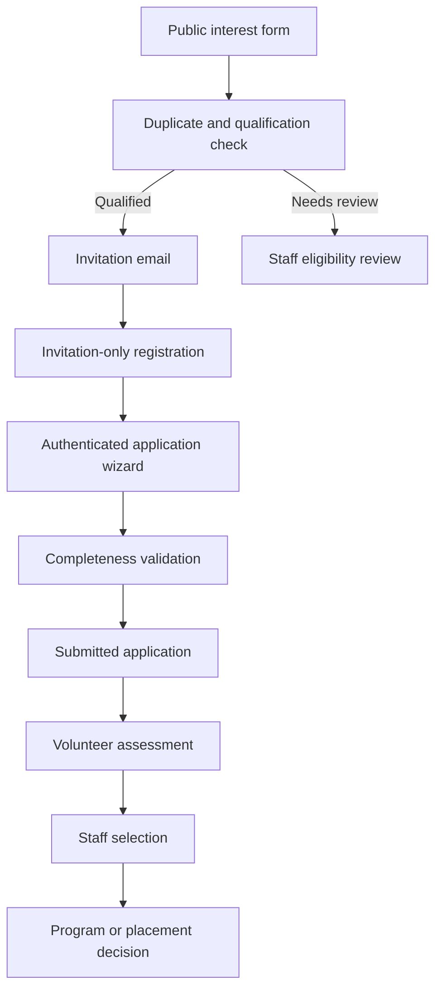
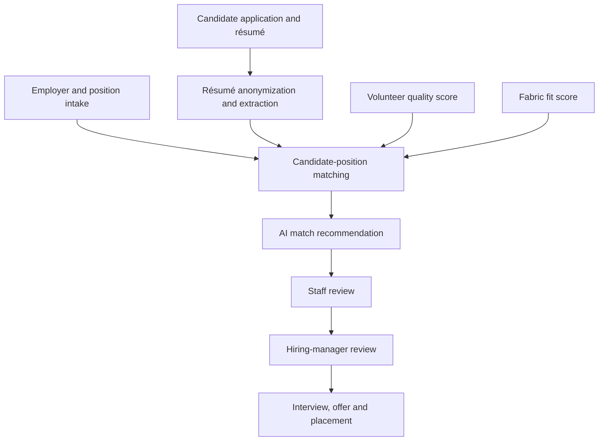
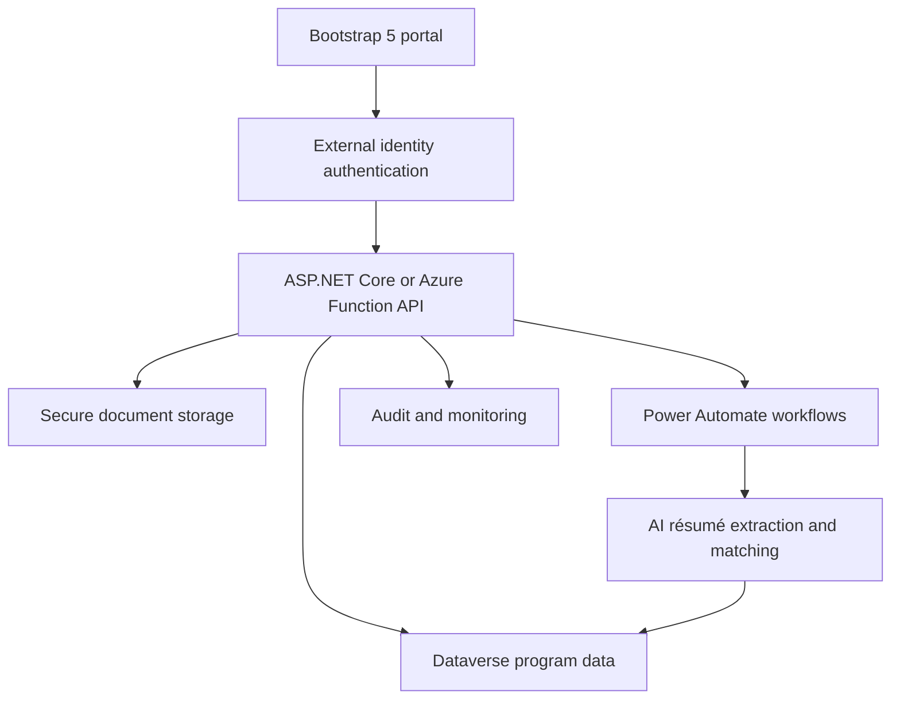

# Degrees of Change workflow analysis

The [Degrees of Change case study](sandbox:/workspace/scratch/a1a80a8ea9b8/upload/Degrees of Change automates nonprofit operations with Power Apps, Power Pages, and AI Builder - Power Platform _ Microsoft L.PDF) describes two connected nonprofit program workflows:

* **Act Six:** student applications, volunteer assessment, staff selection, and college placement.
* **Seed Internships:** student applications, résumé processing, employer-position intake, AI-assisted matching, hiring-manager review, and internship placement.

The document identifies five primary personas:

1. Candidates/students.
2. Community volunteer assessors.
3. Degrees of Change staff.
4. Employers and employer primary contacts.
5. Hiring managers.

The HTML solution should provide a separate, role-specific experience for each persona while maintaining one central program dataset.

# 1. End-to-end workflow pattern

## Candidate application workflow



## Seed internship workflow



The AI-generated match must remain a recommendation. Staff and hiring managers should make the final decision and record their reasoning.

# 2. Recommended workflow statuses

## Candidate interest and application

| Status                       | Meaning                                         |
| ---------------------------- | ----------------------------------------------- |
| `INTEREST_STARTED`           | Candidate opened the public form                |
| `INTEREST_RECEIVED`          | Interest form was submitted                     |
| `QUALIFICATION_PENDING`      | Automated checks are running                    |
| `MANUAL_ELIGIBILITY_REVIEW`  | Staff review is required                        |
| `QUALIFIED`                  | Candidate can apply                             |
| `NOT_QUALIFIED`              | Current qualification rules were not met        |
| `INVITED`                    | Registration invitation was sent                |
| `INVITATION_EXPIRED`         | Invitation was not used in time                 |
| `REGISTERED`                 | Portal account was created                      |
| `APPLICATION_NOT_STARTED`    | Application assignment exists                   |
| `APPLICATION_IN_PROGRESS`    | Candidate saved at least one section            |
| `APPLICATION_INCOMPLETE`     | Required information is missing                 |
| `APPLICATION_SUBMITTED`      | Candidate completed final submission            |
| `APPLICATION_VALIDATION`     | Staff or automated review is underway           |
| `SCORING_ASSIGNMENT_PENDING` | Waiting for volunteer assignment                |
| `SCORING_IN_PROGRESS`        | Volunteer assessments are underway              |
| `SCORING_COMPLETE`           | Required assessments are complete               |
| `STAFF_REVIEW`               | Staff are evaluating the application            |
| `MATCHING`                   | Candidate is being matched to placements        |
| `WAITLISTED`                 | Candidate remains under consideration           |
| `SELECTED`                   | Candidate has been selected                     |
| `NOT_SELECTED`               | Candidate was not selected                      |
| `WITHDRAWN`                  | Candidate withdrew                              |
| `PLACED`                     | Final college or internship placement completed |
| `CLOSED`                     | Program cycle processing is complete            |

## Internship position

| Status                 | Meaning                                       |
| ---------------------- | --------------------------------------------- |
| `DRAFT`                | Employer is preparing the position            |
| `SUBMITTED`            | Position was submitted for review             |
| `CHANGES_REQUESTED`    | Staff requested corrections                   |
| `APPROVED`             | Position can participate in matching          |
| `MATCHING_OPEN`        | Candidate recommendations are being generated |
| `CANDIDATES_AVAILABLE` | Hiring manager can review candidates          |
| `INTERVIEWING`         | Interviews are underway                       |
| `OFFER_PENDING`        | An offer is awaiting decision                 |
| `FILLED`               | Position has been filled                      |
| `CANCELLED`            | Employer withdrew the position                |
| `CLOSED`               | Position processing is complete               |

# 3. Role and access model

| Role                  | Authorized access                                                  |
| --------------------- | ------------------------------------------------------------------ |
| Public Visitor        | Public interest form only                                          |
| Invited Candidate     | Registration page                                                  |
| Candidate             | Own profile, applications, tasks, documents, and status            |
| Volunteer Assessor    | Assigned applications and scoring rubric only                      |
| Volunteer Coordinator | Volunteer profiles and assignments for assigned community          |
| Employer Contact      | Own personal profile, organization, and positions                  |
| Hiring Manager        | Assigned positions and approved candidate profiles                 |
| Program Staff         | Candidate validation, scoring progress, matching, and placement    |
| Matching Staff        | Anonymized résumés, match recommendations, and placement decisions |
| Support Staff         | Support requests and limited diagnostic information                |
| Administrator         | Program cycles, forms, rubrics, deadlines, and access              |
| Auditor               | Read-only history, decisions, access, and changes                  |

# 4. Complete HTML form inventory

## Public and registration forms

| # | Form/page                     | Workflow purpose                           |
| - | ----------------------------- | ------------------------------------------ |
| 1 | `candidate-interest.html`     | Collect basic public interest information  |
| 2 | `qualification-review.html`   | Review automated qualification results     |
| 3 | `invitation-status.html`      | Display invitation state or resend request |
| 4 | `candidate-registration.html` | Create an account using an invitation      |
| 5 | `sign-in.html`                | Authenticate candidates and external users |
| 6 | `account-recovery.html`       | Recover external portal access             |

## Candidate forms

| #  | Form/page                               | Workflow purpose                                     |
| -- | --------------------------------------- | ---------------------------------------------------- |
| 7  | `candidate-dashboard.html`              | Display assignments, deadlines, and status           |
| 8  | `candidate-profile.html`                | Contact and personal profile                         |
| 9  | `candidate-demographics.html`           | Program demographic and background data              |
| 10 | `candidate-education.html`              | School and academic information                      |
| 11 | `candidate-family.html`                 | Family, first-generation, and contextual information |
| 12 | `candidate-activities.html`             | Leadership, employment, service, and honors          |
| 13 | `candidate-essays.html`                 | Written responses and program goals                  |
| 14 | `candidate-college-preferences.html`    | Act Six college and program preferences              |
| 15 | `candidate-internship-preferences.html` | Seed career and internship preferences               |
| 16 | `candidate-skills.html`                 | Skills and experience used for matching              |
| 17 | `candidate-resume.html`                 | Résumé upload and extracted-data review              |
| 18 | `candidate-documents.html`              | Supporting-document uploads                          |
| 19 | `application-review.html`               | Review completeness before submission                |
| 20 | `application-submit.html`               | Certification and final submission                   |
| 21 | `application-withdrawal.html`           | Withdraw an active application                       |
| 22 | `candidate-support.html`                | Request technical or program support                 |

## Volunteer assessor forms

| #  | Form/page                     | Workflow purpose                               |
| -- | ----------------------------- | ---------------------------------------------- |
| 23 | `volunteer-profile.html`      | Volunteer contact, community, and availability |
| 24 | `conflict-disclosure.html`    | Report potential candidate conflicts           |
| 25 | `assessor-dashboard.html`     | Display assigned applications and deadlines    |
| 26 | `application-assessment.html` | Read the assigned application                  |
| 27 | `application-scoring.html`    | Enter rubric scores and notes                  |
| 28 | `assessment-submit.html`      | Certify and finalize an assessment             |
| 29 | `assessor-support.html`       | Submit support requests or feedback            |

## Employer and hiring-manager forms

| #  | Form/page                          | Workflow purpose                             |
| -- | ---------------------------------- | -------------------------------------------- |
| 30 | `employer-contact-profile.html`    | Maintain the primary contact’s profile       |
| 31 | `employer-profile.html`            | Maintain organization information            |
| 32 | `internship-position.html`         | Add or update an internship                  |
| 33 | `hiring-manager-assignment.html`   | Assign managers to positions                 |
| 34 | `position-review-submit.html`      | Validate and submit a position               |
| 35 | `employer-position-dashboard.html` | Monitor position status                      |
| 36 | `candidate-match-list.html`        | View approved match recommendations          |
| 37 | `candidate-review.html`            | Review an anonymized candidate profile       |
| 38 | `interview-feedback.html`          | Record interview outcomes                    |
| 39 | `hiring-decision.html`             | Record shortlist, offer, or decline decision |

## Staff and administrative forms

| #  | Form/page                       | Workflow purpose                            |
| -- | ------------------------------- | ------------------------------------------- |
| 40 | `candidate-validation.html`     | Validate submitted applications             |
| 41 | `assessor-assignment.html`      | Assign applications to volunteers           |
| 42 | `scoring-progress.html`         | Monitor completion and deadlines            |
| 43 | `score-resolution.html`         | Resolve missing or inconsistent assessments |
| 44 | `resume-extraction-review.html` | Validate anonymized résumé extraction       |
| 45 | `match-recommendation.html`     | Review AI-supported matches                 |
| 46 | `placement-decision.html`       | Complete candidate-position placement       |
| 47 | `candidate-communication.html`  | Send workflow-based communications          |
| 48 | `program-cycle.html`            | Configure programs, communities, and dates  |
| 49 | `qualification-rules.html`      | Configure eligibility rules                 |
| 50 | `scoring-rubric.html`           | Configure assessment criteria               |
| 51 | `assignment-template.html`      | Configure task descriptions and deadlines   |
| 52 | `support-triage.html`           | Route and resolve support requests          |
| 53 | `audit-search.html`             | Review decisions and activity history       |

# 5. Public interest and registration forms

## Form 1: Public candidate interest

The document states that this form is public and unauthenticated, so collect only the minimum information needed to determine whether an invitation should be issued.

Fields:

* First name
* Last name
* Preferred name
* Email
* Mobile phone
* ZIP or postal code
* City
* State
* Current high school or college
* Expected graduation year
* Community
* Program of interest:

  * Act Six
  * Seed Internships
  * Both, when allowed
* How the candidate heard about the program
* Age or age-range confirmation, only when required
* Permission to contact
* Privacy notice acknowledgment

Validation:

* Standardize phone-number formatting.
* Validate email format.
* Validate ZIP code against the selected region.
* Prevent duplicate active interest records using normalized email, phone, and name.
* Do not reveal whether another person already exists in the system.
* Add CAPTCHA, submission throttling, and bot protection.
* Do not collect résumés, essays, financial records, or sensitive demographics on this public page.

## Form 2: Qualification review

This is primarily a staff form, although automated rules should process most submissions.

Display:

* Candidate’s submitted interest information
* Existing-contact matches
* Selected program
* Program cycle
* Community
* Qualification-rule results
* Missing information
* Duplicate confidence
* Previous program participation
* Staff notes

Decisions:

* Qualified - send invitation
* Request additional information
* Route to another community
* Duplicate - merge or link
* Not currently qualified
* Escalate for manual review

An override requires a reason.

## Form 3: Invitation status

Fields:

* Email
* Invitation code, when entered manually
* Request another invitation
* Contact support

Rules:

* Codes must be single-use.
* Codes must expire.
* Codes must be tied to the intended email and program cycle.
* Do not create accounts without a valid invitation.
* Store only a hash of the invitation token.

## Form 4: Candidate registration

Fields:

* Invitation code, resolved from URL
* Email, prepopulated and read-only
* First and last name
* Password or external identity-provider registration
* Mobile phone
* Communication preference
* Terms of use
* Privacy acknowledgment
* Consent to electronic communications

Upon successful registration:

1. Mark invitation as used.
2. Link the identity to the existing contact.
3. Create the candidate’s application assignment.
4. Redirect the candidate to the assignments dashboard.

# 6. Candidate dashboard and application wizard

The screenshot shows an assignments page containing:

* Description
* Due date
* Status
* Action
* “Start Application” button

The dashboard should also show:

* Application progress percentage
* Completed sections
* Missing sections
* Next task
* Important dates
* New messages
* Document status
* Support link

## Candidate application stepper

```text
Profile → Background → Education → Family Context
        → Activities → Essays → Program Preferences
        → Résumé/Documents → Review → Submit
```

Only show program-relevant steps. Act Six and Seed should not force candidates through unrelated questions.

## Form 8: Candidate profile

Fields:

* Legal name
* Preferred name
* Pronouns, optional
* Date of birth, when required
* Email
* Mobile phone
* Alternate phone
* Address
* City
* State
* ZIP code
* Country
* Preferred language
* Communication preferences
* Emergency contact, when required

## Form 9: Demographics and background

The scoring-app screenshot displays demographic fields such as:

* Gender
* Race and ethnicity
* Country or countries
* Birthplace
* Native language
* Home language

These fields are sensitive and should be:

* Collected only when needed.
* Clearly identified as required or optional.
* Protected from employers and hiring managers.
* Excluded from the AI matching feature unless explicitly justified and formally approved.
* Hidden from volunteer assessors when the program’s review policy requires blind assessment.

## Form 10: Education

Fields:

* Current school
* School district
* Expected graduation date
* Grade level
* GPA and scale
* Academic program
* College credits
* Relevant coursework
* Academic honors
* Counselor
* College enrollment status
* Transcript upload, when required
* Educational goals

Validation:

* Graduation date must align with the program cycle.
* GPA must be validated against the selected scale.
* Required documents should show an upload and verification status.

## Form 11: Family and contextual information

The scoring screenshot contains:

* Low-income indicator
* First-generation indicator
* Parents’ marital status
* Lives-with information
* Applicant marital status
* Dependents
* Foster-care history
* Number of siblings
* Parent birth country
* Parent occupation
* Parent highest degree

Use conditional visibility:

* If `First generation = Yes`, display explanatory questions only when required.
* If `Dependents > 0`, display dependent details.
* If `Foster care = Yes`, display only the program-relevant follow-up.
* If parent information is unavailable, allow `Unknown` or `Not applicable`.

Do not force candidates to fabricate unavailable family information.

## Form 12: Activities, employment, and honors

Use repeatable entries.

Fields per activity:

* Activity type
* Organization
* Role
* Description
* Leadership role
* Grade levels
* Hours per week
* Weeks per year
* Start and end dates
* Ongoing indicator
* Community impact
* Recognition or honors
* Contact person, only if required

Activity types:

* Leadership
* Community service
* Employment
* Internship
* Extracurricular activity
* Family responsibility
* Athletics
* Faith or community organization
* Award or honor
* Other

## Form 13: Essays and written responses

Recommended sections aligned with the documented scoring rubric:

* Leadership experience
* Service and community contribution
* Personal vision
* Contribution to diversity or community
* Character and resilience
* College or career goals
* Additional context

Features:

* Character and word counter.
* Save draft.
* Autosave.
* Plain-text paste cleanup.
* Minimum and maximum word validation.
* No score display to the candidate.
* Clear statement about acceptable AI-writing assistance, according to program policy.

## Form 14: Act Six preferences

Fields:

* Preferred partner colleges
* Academic interests
* Intended major
* Campus preferences
* Location constraints
* Housing requirements
* Program commitment confirmation
* Willingness to consider alternate placements

## Form 15: Seed internship preferences

Fields:

* Career-interest areas
* Preferred industries
* Preferred job functions
* Preferred work location
* Remote, hybrid, or on-site preference
* Available start and end dates
* Weekly availability
* Transportation availability
* Accessibility or accommodation request
* Compensation expectations, when applicable
* Internship goals
* Industries or roles the candidate does not want considered

## Form 16: Candidate skills

Use structured, repeatable skills.

Fields:

* Skill
* Category
* Proficiency
* Years of experience
* Evidence or example
* Related coursework
* Certification
* Preferred-use indicator

Skill categories:

* Technical
* Communication
* Leadership
* Research
* Data and analytics
* Marketing
* Finance
* Design
* Customer service
* Languages
* Other

## Form 17: Résumé upload and extraction

Fields:

* Résumé file
* File language
* Candidate certification
* Processing consent
* Résumé version
* Optional notes

After upload:

1. Virus-scan the file.
2. Preserve the original securely.
3. Generate an anonymized processing copy.
4. Remove or mask name, email, phone, address, photograph, and other direct identifiers.
5. Extract education, skills, employment, projects, and certifications.
6. Allow staff to validate extracted information.
7. Store the AI model and processing version.

The candidate should be allowed to review extracted skills and experience, but not internal match scores.

## Form 19: Application review

Display:

* Section-completeness checklist
* Missing required fields
* Missing documents
* Validation warnings
* Application deadline
* Last saved date
* Read-only preview

Actions:

* Return to section
* Download applicant copy
* Continue editing
* Proceed to certification

## Form 20: Final submission

Fields:

* Information is accurate
* Candidate completed the application
* Privacy acknowledgment
* Program terms acknowledgment
* Electronic signature
* Submission confirmation

After submission:

* Lock candidate-editable sections.
* Save an immutable submission snapshot.
* Send confirmation.
* Create staff-validation tasks.
* Allow reopening only through a controlled staff action.

# 7. Volunteer assessment workflow

## Form 23: Volunteer profile

Fields:

* Name
* Email
* Phone
* Community
* Languages
* Availability
* Relevant experience
* Maximum assignment count
* Accessibility needs
* Training completion
* Confidentiality agreement
* Conflict-of-interest acknowledgment

## Form 24: Conflict disclosure

Fields:

* Candidate
* Relationship type
* Relationship description
* Potential bias or conflict
* Can the volunteer assess fairly?
* Requested action
* Notes

Actions:

* Continue assignment
* Reassign application
* Escalate to coordinator

## Form 25: Assessor dashboard

Display:

* Applicant group
* Assigned applications
* Due date
* Status
* Days remaining
* Applications scored
* Applications remaining
* Required daily pace
* Tutorial video
* Rubric help
* Support request

Do not expose applications that are not assigned to the logged-in volunteer.

## Forms 26–28: Application assessment and scoring

The screenshot shows seven scoring categories:

* Leadership
* Service
* Vision
* Diversity
* Character
* College
* Writing

Recommended scoring fields:

* Criterion score
* Criterion-specific comment
* Evidence from application
* Confidence in score
* Overall notes
* Incomplete-information flag
* Conflict discovered during review
* Final assessment certification

Rules:

* Display rubric help beside every criterion.
* Use the same score range across assessors, such as 1–5.
* Require comments for extreme scores.
* Save scores as a draft.
* Hide other assessors’ scores until the volunteer submits.
* Lock the assessment after submission.
* Allow reopening only through a coordinator action.
* Track completion time and deadline.
* Never allow a volunteer to change the candidate’s application.

# 8. Employer and hiring-manager workflow

The employer portal screenshot defines three initial tasks:

1. Update personal profile.
2. Update employer profile.
3. Add and monitor position profiles.

## Form 30: Employer contact profile

Fields:

* Name
* Job title
* Department
* Email
* Phone
* Preferred contact method
* Decision-making role
* Authorized organization
* Communication preferences

## Form 31: Employer profile

Fields:

* Organization name
* Legal name
* Industry
* Organization type
* Website
* Description
* Headquarters address
* Internship locations
* Primary contact
* Number of employees
* Diversity and inclusion statement, optional
* Accessibility contact
* Billing or agreement contact
* Program participation history
* Organization status

## Form 32: Internship position

Fields:

* Position title
* Department
* Hiring manager
* Position summary
* Responsibilities
* Required skills
* Preferred skills
* Relevant majors
* Education level
* Location
* Work arrangement
* Start and end dates
* Weekly hours
* Schedule
* Compensation
* Number of openings
* Supervisor
* Equipment provided
* Transportation requirements
* Accessibility information
* Interview process
* Application deadline
* Position status

Validation:

* Do not allow protected-characteristic preferences.
* Required skills must be job-related.
* End date must follow start date.
* Hiring manager must belong to the employer.
* Position must be approved before AI matching.

## Form 33: Hiring-manager assignment

Fields:

* Position
* Hiring manager
* Manager email
* Backup manager
* Review deadline
* Permission scope
* Notification preference

## Form 37: Hiring-manager candidate review

Display only approved candidate information:

* Anonymized candidate identifier
* Relevant skills
* Education
* Experience
* Availability
* Volunteer quality score, only when policy allows
* Fabric fit score
* AI match recommendation
* Match explanation
* Missing requirements
* Staff notes approved for employer visibility

Actions:

* Shortlist
* Request interview
* Hold
* Decline
* Request more information

Employers should not receive demographic, family, financial, or other protected information.

## Forms 38–39: Interview and hiring decision

Fields:

* Candidate
* Position
* Interview date
* Interview format
* Interviewers
* Competency ratings
* Interview notes
* Strengths
* Concerns
* Recommended next step
* Decision
* Decision reason
* Offer date
* Offer expiration
* Candidate response

# 9. Staff selection and matching forms

## Form 40: Candidate validation

Display:

* Submission completeness
* Eligibility-rule results
* Duplicate matches
* Document verification
* Required consent
* Program and community
* Candidate-requested corrections
* Staff notes

Actions:

* Accept for scoring
* Return to candidate
* Request document
* Route to another program
* Withdraw
* Reject with reason

## Form 41: Assessor assignment

Fields:

* Candidate
* Community
* Required assessor count
* Assigned volunteers
* Conflict results
* Due date
* Priority
* Assignment instructions

Rules:

* Prevent known conflicts.
* Balance assignment counts.
* Require the configured number of independent assessments.
* Restrict volunteers to their assigned communities unless authorized.

## Form 42: Scoring monitor

Display:

* Candidate
* Assigned assessors
* Completed assessments
* Missing assessments
* Average score
* Score variance
* Due date
* SLA status
* Reassignment needed

Large scoring differences should be flagged for staff review, not automatically averaged without context.

## Form 44: Résumé extraction review

Display side-by-side:

* Original résumé
* Anonymized résumé
* Extracted education
* Extracted skills
* Extracted experience
* Extracted certifications
* Removed identifiers
* AI confidence
* Extraction warnings

Actions:

* Correct extraction
* Approve anonymization
* Reprocess
* Reject document
* Escalate privacy concern

## Form 45: Match recommendation

The documented AI process combines:

* Extracted résumé and application data.
* Internship requirements.
* Volunteer candidate-quality score.
* Microsoft Fabric candidate-fit score.
* AI-generated recommendation.
* AI-generated explanation.

Display:

* Candidate
* Position
* Required skills met
* Preferred skills met
* Missing skills
* Availability compatibility
* Location compatibility
* Candidate-quality score
* Fit score
* AI recommendation
* Explanation
* Model version
* Data used
* Potential fairness warning
* Staff decision
* Override reason

Decisions:

* Recommend match
* Consider as alternative
* Do not recommend
* Request additional review
* Send to hiring manager
* Recalculate after correction

## Form 46: Placement decision

Fields:

* Candidate
* Program
* Employer
* Position
* Hiring manager
* Placement status
* Offer date
* Acceptance date
* Start date
* End date
* Compensation
* Work location
* Assigned staff member
* Onboarding requirements
* Candidate notification
* Employer notification
* Placement notes

# 10. Support-request form

The document describes a built-in support request routed by Power Automate.

Fields:

* Requester
* Persona
* Program
* Portal page
* Application or position ID
* Issue category
* Severity
* Description
* Expected result
* Screenshot
* Browser and device information
* Permission to contact
* Preferred contact method

Categories:

* Cannot sign in
* Invitation problem
* Application problem
* Upload failure
* Assessment problem
* Employer-profile problem
* Position problem
* Candidate-match problem
* Accessibility issue
* Incorrect data
* Enhancement suggestion

Routing should depend on category, program, community, and severity.

# 11. Workflow-driven page behavior

The API should return the current status and permitted actions:

```json
{
  "applicationId": "APP-2026-001254",
  "program": "SEED",
  "status": "APPLICATION_IN_PROGRESS",
  "completionPercentage": 72,
  "requiredSections": [
    "profile",
    "education",
    "activities",
    "resume",
    "internshipPreferences"
  ],
  "allowedActions": [
    "save",
    "uploadDocument",
    "review",
    "submit",
    "withdraw"
  ]
}
```

The HTML application renders controls from `allowedActions`, while the backend independently enforces the same rules.

# 12. Recommended data model

| Entity                  | Purpose                                               |
| ----------------------- | ----------------------------------------------------- |
| `Contacts`              | Candidate, volunteer, staff, and employer identities  |
| `ProgramCycles`         | Program, community, year, and deadlines               |
| `CandidateInterests`    | Public interest submissions                           |
| `Invitations`           | Registration invitations                              |
| `Applications`          | Application master and status                         |
| `ApplicationSections`   | Section completion and saved data                     |
| `CandidateEducation`    | Education history                                     |
| `CandidateActivities`   | Leadership, employment, and service                   |
| `CandidateEssays`       | Written responses                                     |
| `CandidateSkills`       | Structured candidate skills                           |
| `CandidateDocuments`    | Résumés and supporting documents                      |
| `ResumeExtractions`     | Anonymized and extracted résumé data                  |
| `Volunteers`            | Assessor profile and availability                     |
| `AssessmentAssignments` | Volunteer-to-application assignments                  |
| `Assessments`           | Scores, notes, and status                             |
| `RubricCriteria`        | Leadership, service, vision, and other criteria       |
| `Employers`             | Organization profiles                                 |
| `EmployerContacts`      | Employer users and roles                              |
| `InternshipPositions`   | Position requirements                                 |
| `CandidateFitScores`    | Fabric-generated fit values                           |
| `MatchRecommendations`  | AI recommendation and explanation                     |
| `Interviews`            | Interview events and feedback                         |
| `Placements`            | Final candidate placements                            |
| `Tasks`                 | Candidate, volunteer, employer, and staff assignments |
| `SupportRequests`       | Support cases and improvement ideas                   |
| `Communications`        | Invitation, reminder, and decision messages           |
| `AuditEvents`           | Access, changes, scoring, matching, and decisions     |

# 13. HTML project structure

```text
degrees-of-change-portal/
├── index.html
├── public/
│   ├── candidate-interest.html
│   ├── invitation-status.html
│   ├── candidate-registration.html
│   ├── sign-in.html
│   └── account-recovery.html
├── candidate/
│   ├── dashboard.html
│   ├── profile.html
│   ├── demographics.html
│   ├── education.html
│   ├── family.html
│   ├── activities.html
│   ├── essays.html
│   ├── college-preferences.html
│   ├── internship-preferences.html
│   ├── skills.html
│   ├── resume.html
│   ├── documents.html
│   ├── review.html
│   └── submit.html
├── volunteer/
│   ├── profile.html
│   ├── conflict-disclosure.html
│   ├── assignments.html
│   ├── application-review.html
│   └── scoring.html
├── employer/
│   ├── contact-profile.html
│   ├── employer-profile.html
│   ├── position.html
│   ├── hiring-manager-assignment.html
│   ├── candidate-matches.html
│   ├── candidate-review.html
│   └── hiring-decision.html
├── staff/
│   ├── candidate-validation.html
│   ├── assessor-assignment.html
│   ├── scoring-progress.html
│   ├── resume-extraction-review.html
│   ├── match-recommendation.html
│   ├── placement-decision.html
│   └── communication.html
├── administration/
│   ├── program-cycle.html
│   ├── qualification-rules.html
│   ├── scoring-rubric.html
│   ├── assignment-template.html
│   └── support-triage.html
└── assets/
    ├── css/
    │   ├── app.css
    │   ├── forms.css
    │   ├── portal.css
    │   └── scoring.css
    └── js/
        ├── auth.js
        ├── api.js
        ├── workflow.js
        ├── validation.js
        ├── conditional-fields.js
        ├── autosave.js
        ├── uploads.js
        ├── scoring.js
        └── matching.js
```

# 14. Recommended architecture



Recommended components:

* Bootstrap 5 responsive portal.
* Microsoft Entra external identity or the organization’s existing B2C configuration.
* Entra ID for staff and volunteer access.
* ASP.NET Core Web API or Azure Functions.
* Dataverse for shared program information.
* Blob Storage or SharePoint for secured documents.
* Power Automate for invitations, reminders, support routing, and matching orchestration.
* AI Builder or another controlled AI service for résumé extraction and recommendations.
* Application Insights for errors and performance.

# 15. Build sequence

1. Document Act Six and Seed program differences.
2. Define candidate, volunteer, employer, hiring-manager, and staff roles.
3. Define workflow statuses and permitted transitions.
4. Define program-cycle dates and qualification rules.
5. Create the shared data model.
6. Configure public and authenticated security boundaries.
7. Build the public interest form with minimal information.
8. Implement duplicate and qualification processing.
9. Build invitation-only registration.
10. Build the role-based portal shell.
11. Build the candidate assignments dashboard.
12. Build the multi-page application wizard.
13. Add conditional question visibility.
14. Add phone, email, date, and document validation.
15. Add autosave and completion tracking.
16. Build review, certification, and final submission.
17. Build the volunteer profile and conflict disclosure.
18. Build the assessor assignment queue.
19. Build the sectional application-reading interface.
20. Build the scoring rubric and notes.
21. Add assessment progress and deadline monitoring.
22. Build employer-contact and organization profiles.
23. Build internship-position intake.
24. Add hiring-manager assignments.
25. Build résumé upload, anonymization, and extraction review.
26. Build AI recommendation orchestration.
27. Build the staff matching workspace.
28. Build hiring-manager candidate review.
29. Build interview, hiring, and placement decisions.
30. Add invitation, reminder, support, and decision communications.
31. Add access, scoring, recommendation, and decision auditing.
32. Conduct accessibility and mobile testing.
33. Conduct privacy and role-authorization testing.
34. Test AI matching for bias and unsupported recommendations.
35. Deploy through development, test, UAT, and production.
36. Pilot with one community and one employer group before broad rollout.

# 16. Critical safeguards

* Public forms should collect minimal personal information.
* Only invited, qualified candidates should create applicant accounts.
* Candidates can access only their records.
* Volunteers can access only assigned applications.
* Employers can access only their organization and positions.
* Hiring managers see only approved, job-relevant candidate information.
* Demographics, family circumstances, and protected attributes must not appear in employer views.
* Résumés should be anonymized before AI matching.
* AI matching should use job-related skills, experience, availability, and requirements.
* AI recommendations must not automatically select or reject candidates.
* Every staff override must capture a reason.
* Rubrics must be versioned by program cycle.
* Volunteer scores must remain hidden from other assessors until submission.
* Supporting documents must be virus-scanned and securely stored.
* Sensitive field access and document downloads must be audited.
* Candidate submission snapshots should remain immutable.
* Reopening an application or assessment requires authorized staff and a reason.
* Forms must support keyboard navigation, screen readers, clear errors, autosave, and mobile use.

This design follows the documented workflow: public interest, automated validation, invitation-only registration, authenticated application intake, secure volunteer scoring, employer-position intake, anonymized AI-assisted matching, human review, and final placement.
